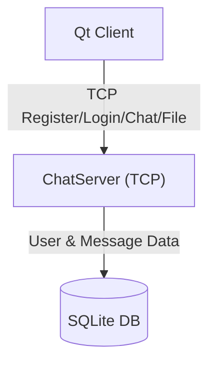

# msrChat (High Performance Distributed Instant Messaging System)

<p align="center">
  
  
  
  
</p>

---

## 📖 项目简介 (Introduction)

**msrChat** 是一个现代化的分布式即时通讯（IM）系统，采用 **C++17** 标准开发。

服务端基于 **Boost.Asio** 异步网络库构建高性能 TCP 服务器，内置用户认证（注册/登录/重置密码），使用 **SQLite** 本地存储用户与消息数据，支持文件传输。客户端使用 **Qt** 框架，通过单一 TCP 长连接与服务端通信。

### 📅 最新进展 (Latest Updates)
*   **重构完成**: 移除 GateServer/StatusServer，ChatServer 内置认证，客户端统一使用 TcpMgr 通信模块。

## 🏗️ 系统架构 (Architecture)



*   **ChatServer**: TCP 聊天服务器，内置用户认证（注册/登录/重置密码）、消息收发、文件传输。
*   **Qt Client**: 跨平台客户端，通过 TCP 长连接与服务端通信，使用 TLV 协议封包。

## 📂 目录结构 (Directory Structure)

```
msrChat/
├── client/                 # 客户端源码
│   └── QmsrChat/           # Qt 客户端工程
├── server/                 # 服务端源码
│   └── ChatServer/         # TCP 聊天服务器
│       ├── include/        # 头文件
│       │   ├── Protocol/   # TLV 协议实现
│       │   ├── CSession.h  # 会话管理
│       │   ├── CServer.h   # 服务器核心
│       │   ├── SQLiteMgr.h # SQLite 数据库
│       │   ├── ThreadPool.h# 线程池
│       │   ├── MsgQueue.h  # 消息队列
│       │   ├── FileTransfer.h # 文件传输
│       │   ├── ObjectPool.h # 对象池
│       │   └── ShardedMap.h # 分片哈希表
│       └── src/            # 源文件
└── README.md
```

## ✨ 核心特性 (Key Features)

*   **⚡ 高性能网络模型**：
    *   **Boost.Asio 异步 I/O**: 基于 Epoll/IOCP 实现非阻塞 I/O，单机支持万级并发。
    *   **IO Context Pool**: 多线程 Reactor 模型，轮询分发连接，充分利用多核 CPU。
    *   **ThreadPool**: 任务线程池，分离 I/O 与业务逻辑计算。

*   **📦 高效通信协议**：
    *   **TLV 协议**: Type-Length-Value 封包格式，完美解决 TCP 粘包/拆包问题。
    *   **单一 TCP 长连接**: 注册、登录、聊天、文件传输全部复用一条连接。

*   **💾 数据存储与优化**：
    *   **SQLite 本地存储**: 用户数据、验证码、聊天记录全部存储在 SQLite 数据库中，零外部依赖。
    *   **对象池 (ObjectPool)**: 减少频繁 `new/delete` 开销，降低内存碎片。
    *   **分片哈希表 (ShardedMap)**: 多桶分片，减少锁竞争，提升并发读写性能。
    *   **消息队列 (MsgQueue)**: 异步消息处理，削峰填谷。

*   **🛡️ 安全与工程化**：
    *   **密码安全**: 密码经过 SHA256 哈希后传输存储。
    *   **RAII 资源管理**: 全面使用智能指针管理内存和资源。
    *   **Singleton 单例模式**: 统一管理全局配置、数据库连接等核心组件。

## 🛠️ 技术栈 (Tech Stack)

| 类别 | 技术 | 说明 |
| :--- | :--- | :--- |
| **语言** | C++17 | 使用 lambda, smart pointers, mutex 等现代特性 |
| **网络** | Boost.Asio | 高性能异步网络库 |
| **数据库** | SQLite3 | 轻量级嵌入式数据库，零配置 |
| **客户端** | Qt 5 / Qt 6 | 跨平台 GUI 框架 |
| **构建** | CMake | 跨平台构建系统 |

## 🚀 编译与运行 (Build & Run)

### 1. 依赖项 (Dependencies)

*   **Compiler**: GCC 9+ / Clang 10+ / MSVC 2019+ (C++17 Support)
*   **CMake**: 3.15+
*   **Libraries**:
    *   Boost (system, thread, filesystem, asio)
    *   SQLite3 (libsqlite3-dev)
    *   Qt 5.12+ (Client only)

### 2. 服务端编译 (Server)

```bash
cd server/ChatServer
mkdir -p build && cd build
cmake .. && make -j4
```

### 3. 运行服务 (Run Services)

```bash
# 启动 ChatServer
./ChatServer
```

### 4. 客户端编译 (Client)

```bash
cd client/QmsrChat
mkdir -p build && cd build
cmake .. && make -j4
./QmsrChat
```

## 📄 许可证 (License)

本项目采用 [MIT License](LICENSE) 许可证。
