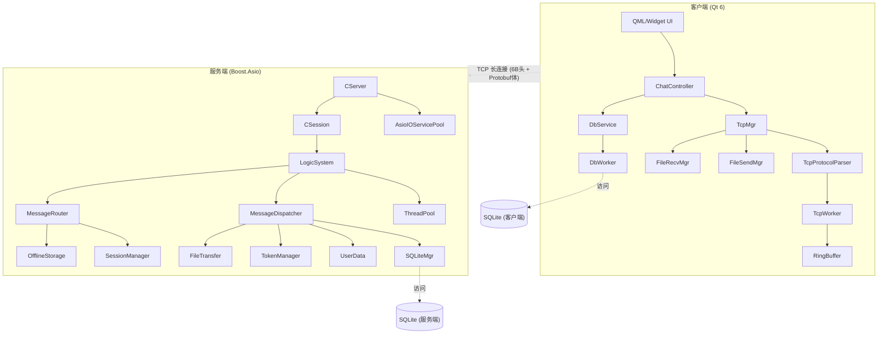

# msrChat (基于 Qt/Boost.Asio 的即时通讯系统)

<p align="center">
  
  
  
  
</p>

---

## 项目简介

**msrChat** 是一个即时通讯（IM）系统，采用 **C++17** 标准开发。客户端使用 **Qt 6**（含 QML），服务端基于 **Boost.Asio** 异步网络库，通信协议使用 **Protobuf** 序列化，客户端与服务端通过单一 TCP 长连接通信。

服务端内置用户认证（注册/登录/重置密码），使用 **SQLite** 存储用户与消息数据，支持文件传输和离线消息。客户端本地也使用 SQLite 进行消息持久化。

### 核心功能

| 功能 | 说明 |
|------|------|
| **用户认证** | 注册（邮箱验证码）、登录（SHA256）、重置密码 |
| **消息收发** | 文本消息、离线消息分页拉取、消息确认（ACK）机制 |
| **文件传输** | 分块传输、断点续传、MD5 校验 |
| **心跳检测** | 客户端定时 ping/pong，超时自动重连 |
| **自动重连** | 连接断开后指数退避重连（3s ~ 60s） |
| **本地消息存储** | 客户端 SQLite 持久化聊天记录 |

## 系统架构



### 服务端组件

| 组件 | 文件 | 说明 |
|------|------|------|
| **CServer** | `CServer.h/.cpp` | TCP 服务器入口，管理连接接入和会话生命周期 |
| **AsioIOServicePool** | `AsioIOServicePool.h/.cpp` | I/O 上下文池，多线程处理网络事件 |
| **CSession** | `CSession.h/.cpp` | 单会话管理，协议解析（6字节头 + Protobuf body），支持文件接收状态 |
| **LogicSystem** | `LogicSystem.h/.cpp` | 业务逻辑入口，通过 ThreadPool 异步处理 MessageTask |
| **MessageDispatcher** | `MessageDispatcher.h/.cpp` | 消息处理器注册表，根据 msg_id 分发到对应 handler，支持鉴权检查 |
| **MessageRouter** | `MessageRouter.h/.cpp` | 消息路由，在线转发 / 离线存储 |
| **SessionManager** | `SessionManager.h/.cpp` | 用户会话管理器，使用 ShardedMap 实现多分片并发读写 |
| **SQLiteMgr** | `SQLiteMgr.h/.cpp` | SQLite 连接池（RAII），支持优雅关闭 |
| **UserData** | `UserData.h/.cpp` | 用户数据操作（注册、登录、密码重置） |
| **TokenManager** | `TokenManager.h/.cpp` | Token 生成与验证 |
| **OfflineStorage** | `OfflineStorage.h/.cpp` | 离线消息存储与批量发送（使用 shared_mutex） |
| **FileTransfer** | `FileTransfer.h/.cpp` | 文件传输核心，支持分块传输和断点续传 |
| **ThreadPool** | `ThreadPool.h/.cpp` | 通用任务线程池，用于业务逻辑异步处理 |
| **ObjectPool** | `ObjectPool.h` | 对象池模板，SendNode/RecvNode 复用 |
| **ShardedMap** | `ShardedMap.h` | 多分片哈希表，支持高并发读写 |

### 协议模块

| 组件 | 文件 | 说明 |
|------|------|------|
| **BaseProtocol** | `Protocol/BaseProtocol.h/.cpp` | 协议抽象基类 |
| **TLVProtocol** | `Protocol/TLVProtocol.h/.cpp` | TLV 格式协议实现 |
| **BinaryPacketProtocol** | `Protocol/BinaryPacketProtocol.h/.cpp` | 二进制包协议实现 |
| **PacketNode** | `Protocol/PacketNode.h` | 协议包节点数据结构 |

### 客户端组件

| 组件 | 文件 | 说明 |
|------|------|------|
| **MainWindow** | `MainWindow.h/.cpp` | 主窗口 |
| **LoginDialog** | `LoginDialog.h/.cpp` | 登录对话框 |
| **RegisterDialog** | `RegisterDialog.h/.cpp` | 注册对话框 |
| **ResetDialog** | `ResetDialog.h/.cpp` | 重置密码对话框 |
| **ChatDialog** | `ChatDialog.h/.cpp` | 聊天窗口 |
| **ChatController** | `ChatController.h/.cpp` | 聊天业务控制器（发送/接收消息路由） |
| **TcpMgr** | `TcpMgr.h/.cpp` | TCP 连接管理器 |
| **TcpWorker** | `TcpWorker.h/.cpp` | TCP 通信核心，独立线程，含 RingBuffer 和心跳 |
| **TcpProtocolParser** | `TcpProtocolParser.h/.cpp` | 协议解析，分离登录/聊天消息处理 |
| **FileSendMgr** | `FileSendMgr.h/.cpp` | 文件发送管理，分块发送（64KB/chunk） |
| **FileRecvMgr** | `FileRecvMgr.h/.cpp` | 文件接收管理，临时文件 + rename 机制 |
| **DbService** | `DbService.h/.cpp` | 数据库服务接口，发送信号驱动 DbWorker |
| **DbWorker** | `DbWorker.h/.cpp` | SQLite 数据库操作工作线程 |
| **RingBuffer** | `RingBuffer.h` | 环形缓冲区，支持自动扩容（64KB ~ 4MB） |
| **ChatListModel** | `ChatListModel.h/.cpp` | QAbstractListModel 子类，供 QML ListView 使用 |
| **UserMgr** | `UserMgr.h/.cpp` | 用户数据管理 |
| **Logger** | `Logger.h/.cpp` | spdlog 日志封装 |
| **DPIHelper** | `DPIHelper.h` | DPI 缩放辅助 |
| **TimerBtn** | `TimerBtn.h/.cpp` | 验证码倒计时按钮 |
| **ClickedLabel** | `ClickedLabel.h/.cpp` | 可点击状态标签 |

## 目录结构

```
msrChat/
├── client/                              # Qt 客户端
│   └── QmsrChat/
│       ├── include/                     # 头文件 (27)
│       │   ├── AuthUiHelpers.h
│       │   ├── ChatController.h
│       │   ├── ChatDialog.h
│       │   ├── ChatListModel.h
│       │   ├── ClickedLabel.h
│       │   ├── DbService.h
│       │   ├── DbWorker.h
│       │   ├── DPIHelper.h
│       │   ├── FileRecvMgr.h
│       │   ├── FileSendMgr.h
│       │   ├── Global.h
│       │   ├── Logger.h
│       │   ├── logmacros.h
│       │   ├── LoginDialog.h
│       │   ├── MainWindow.h
│       │   ├── PathUtils.h
│       │   ├── ProtocolStructs.h
│       │   ├── RegisterDialog.h
│       │   ├── ResetDialog.h
│       │   ├── RingBuffer.h
│       │   ├── singleton.h
│       │   ├── TcpMgr.h
│       │   ├── TcpProtocolParser.h
│       │   ├── TcpWorker.h
│       │   ├── TimerBtn.h
│       │   ├── UserMgr.h
│       │   └── Utils.h
│       ├── src/                         # 源文件 (20)
│       │   ├── main.cpp
│       │   ├── ChatController.cpp
│       │   ├── ChatDialog.cpp
│       │   ├── ChatListModel.cpp
│       │   ├── ClickedLabel.cpp
│       │   ├── DbService.cpp
│       │   ├── DbWorker.cpp
│       │   ├── FileRecvMgr.cpp
│       │   ├── FileSendMgr.cpp
│       │   ├── Logger.cpp
│       │   ├── LoginDialog.cpp
│       │   ├── MainWindow.cpp
│       │   ├── RegisterDialog.cpp
│       │   ├── ResetDialog.cpp
│       │   ├── TcpMgr.cpp
│       │   ├── TcpProtocolParser.cpp
│       │   ├── TcpWorker.cpp
│       │   ├── TimerBtn.cpp
│       │   ├── UserMgr.cpp
│       │   └── Utils.cpp
│       ├── ui/                          # Qt Designer UI 文件 (5)
│       ├── style/                       # QSS 样式表
│       ├── proto/                       # Protobuf 定义
│       │   └── Message.proto
│       ├── resources/                   # 平台资源
│       │   └── win32/app.rc
│       ├── ChatView.qml                 # QML 主聊天视图
│       ├── MessageBubble.qml            # QML 消息气泡组件
│       ├── resources.qrc
│       ├── config.ini.example
│       └── CMakeLists.txt
├── server/                              # 服务端
│   └── ChatServer/
│       ├── include/                     # 头文件 (25)
│       │   ├── Protocol/
│       │   │   ├── BaseProtocol.h
│       │   │   ├── BinaryPacketProtocol.h
│       │   │   ├── PacketNode.h
│       │   │   └── TLVProtocol.h
│       │   ├── AsioIOServicePool.h
│       │   ├── const.h
│       │   ├── CServer.h
│       │   ├── CSession.h
│       │   ├── CSingleton.h
│       │   ├── FileDescriptor.h
│       │   ├── FileTransfer.h
│       │   ├── FileTransferState.h
│       │   ├── LogicSystem.h
│       │   ├── MessageDispatcher.h
│       │   ├── MessageRouter.h
│       │   ├── MessageTask.h
│       │   ├── ObjectPool.h
│       │   ├── OfflineSendState.h
│       │   ├── OfflineStorage.h
│       │   ├── SessionManager.h
│       │   ├── ShardedMap.h
│       │   ├── SQLiteMgr.h
│       │   ├── ThreadPool.h
│       │   ├── TokenManager.h
│       │   └── UserData.h
│       ├── src/                         # 源文件 (17)
│       │   ├── Protocol/
│       │   │   ├── BaseProtocol.cpp
│       │   │   ├── BinaryPacketProtocol.cpp
│       │   │   └── TLVProtocol.cpp
│       │   ├── AsioIOServicePool.cpp
│       │   ├── CServer.cpp
│       │   ├── CSession.cpp
│       │   ├── FileTransfer.cpp
│       │   ├── LogicSystem.cpp
│       │   ├── main.cpp
│       │   ├── MessageDispatcher.cpp
│       │   ├── MessageRouter.cpp
│       │   ├── OfflineStorage.cpp
│       │   ├── SessionManager.cpp
│       │   ├── SQLiteMgr.cpp
│       │   ├── ThreadPool.cpp
│       │   ├── TokenManager.cpp
│       │   └── UserData.cpp
│       ├── proto/                       # Protobuf 定义
│       │   └── Message.proto
│       ├── config.ini.example
│       └── CMakeLists.txt
├── README.md
└── .gitignore
```

## 技术栈

| 类别 | 技术 | 说明 |
|------|------|------|
| **语言** | C++17 | Lambda、智能指针、atomic、string_view |
| **网络** | Boost.Asio | 异步 I/O、strand、steady_timer |
| **序列化** | Protobuf | 消息序列化与反序列化 |
| **数据库** | SQLite3 | 嵌入式，事务支持，连接池 |
| **客户端** | Qt 6 | Widgets + Quick/QML、Network、Sql |
| **日志** | spdlog / qDebug | 服务端 spdlog，客户端 spdlog + Qt |
| **加密** | OpenSSL | SHA256 密码哈希 |
| **JSON** | nlohmann_json | 配置解析 |
| **构建** | CMake | 跨平台构建，支持 MSVC/GCC/Clang |

## 编译与运行

### 依赖项

**服务端：**
- GCC 9+ / MSVC 2019+ / Clang 10+
- CMake 3.15+
- Boost 1.70+ (system, thread)
- SQLite3
- Protobuf
- OpenSSL
- spdlog
- nlohmann_json

**客户端：**
- Qt 6.2+ (Widgets, Network, Quick, Qml, Sql, QuickWidgets, QuickControls2, QuickLayouts)
- CMake 3.16+
- Protobuf
- spdlog

### 安装依赖（Ubuntu/Debian）

```bash
sudo apt install build-essential cmake
sudo apt install libboost-all-dev libsqlite3-dev libprotobuf-dev protobuf-compiler
sudo apt install libssl-dev libspdlog-dev nlohmann-json3-dev
sudo apt install qt6-base-dev qt6-declarative-dev
```

### 服务端编译

```bash
cd server/ChatServer
mkdir -p build && cd build
cmake .. -DCMAKE_BUILD_TYPE=Release
make -j$(nproc)
```

### 客户端编译

```bash
cd client/QmsrChat
mkdir -p build && cd build
cmake .. -DCMAKE_BUILD_TYPE=Release
make -j$(nproc)
```

> Windows 用户可使用 Qt Creator 打开 `client/QmsrChat/CMakeLists.txt` 进行编译，服务端建议使用 Visual Studio + CMake 或 MSYS2/MinGW。

## 配置说明

### 服务端配置 (`server/ChatServer/config.ini`)

```ini
[ChatServer]
# 服务器监听端口
Port = 8080
# 线程池大小 (0 = 自动使用CPU核心数)
ThreadPoolSize = 0
# 最大连接数
MaxConnections = 1000
# 调试模式
DebugMode = 1

[Log]
# 日志级别: DEBUG, INFO, WARNING, ERROR
Level = INFO
# 日志文件路径
File = ./logs/chatserver.log
# 控制台输出
Console = 1
```

### 客户端配置 (`client/QmsrChat/config.ini`)

```ini
[ChatServer]
host = 127.0.0.1
port = 8080
```

启动前请将 `config.ini.example` 复制为 `config.ini` 并修改配置项。CMake 会在构建时自动将 `config.ini` 复制到输出目录。

## 协议格式

### 二进制帧结构

```
+----------+-------------+-------------------+
| MsgID(2B)| BodyLen(4B) | Protobuf Body     |
+----------+-------------+-------------------+
| 大端序    | 大端序       | Message.proto 序列化 |
+----------+-------------+-------------------+
```

- **MsgID**: 2 字节无符号整数，标识消息类型（大端序）
- **BodyLen**: 4 字节无符号整数，标识 Protobuf 数据体长度（大端序）
- **Body**: Protobuf 序列化后的消息体

### 消息类型

| MsgID | 常量名 | 说明 | 对应 Protobuf 消息 |
|-------|--------|------|-------------------|
| 1000 | `MSG_HELLO` | 心跳 ping/pong | - |
| 1001 | `ID_GET_VARIFY_CODE` | 获取邮箱验证码 | `VerifyCodeReq` / `VerifyCodeRsp` |
| 1002 | `ID_REGISTER_USER` | 用户注册 | `RegisterReq` / `RegisterRsp` |
| 1003 | `ID_RESET_PWD` | 重置密码 | `ResetPwdReq` / `ResetPwdRsp` |
| 1004 | `ID_LOGIN_USER` | 用户登录 | - |
| 1005 | `MSG_CHAT_LOGIN` | 聊天会话认证 | `ChatLoginReq` / `ChatLoginRsp` |
| 1006 | `MSG_CHAT_TEXT` | 文本消息 | `ChatTextMsg` / `ServerChatMsg` |
| 1007 | `MSG_CHAT_ACK` | 消息确认 | `ChatAck` |
| 1008 | `MSG_OFFLINE_ACK` | 离线消息分页确认 | - |
| 2001 | `MSG_FILE_REQ` | 文件传输请求 | `FileReq` / `FileRsp` |
| 2002 | `MSG_FILE_RSP` | 文件传输响应（断点续传） | `FileRsp` |
| 2003 | `MSG_FILE_CHUNK` | 文件数据分片 | `FileChunk` |
| 2004 | `MSG_FILE_ACK` | 数据块接收确认 | `FileAck` |

### Protobuf 消息定义 (`proto/Message.proto`)

```protobuf
syntax = "proto3";
package qmsrchat;

message ChatTextMsg {
    int32 from_uid = 1;
    int32 to_uid = 2;
    string content = 3;
    string client_msg_id = 4;
}

message FileReq {
    int64 task_id = 1;
    int32 from_uid = 2;
    int32 to_uid = 3;
    string filename = 4;
    int64 total_size = 5;
    string md5 = 6;
    int64 offset = 7;
}

message FileChunk {
    int64 task_id = 1;
    int64 offset = 2;
    int64 size = 3;
    bytes data = 4;
}

message FileAck {
    int64 task_id = 1;
    int32 error = 2;
    string message = 3;
    int64 received = 4;
}
// ... 完整定义见 proto/Message.proto
```

### 文件传输流程

```
发送端                          接收端                          协议 (<MsgID>)
  |                               |                             |
  |--- MSG_FILE_REQ ------------->|  (task_id, filename, size)  2001
  |<-- MSG_FILE_RSP --------------|  (task_id, offset=0 Ready)  2002
  |                               |                             |
  |-- MSG_FILE_CHUNK (0, 64KB) -->|                              2003
  |<-- MSG_FILE_ACK --------------|  (task_id, received=64KB)   2004
  |                               |                             |
  |-- MSG_FILE_CHUNK (64KB, ...)->|                              2003
  ... 循环直到发完 ...            |                             |
  |                               |                             |
  |<-- MSG_FILE_ACK (complete) ---|                              2004
```

## 核心模块详解

### 客户端 TcpWorker

TcpWorker 在独立线程中运行（通过 `moveToThread`），负责 TCP 连接、协议解析、心跳和重连：

```cpp
// TcpWorker.h - 核心成员
class TcpWorker : public QObject {
    QTcpSocket *_socket;
    RingBuffer _recv_buffer;
    QTimer *_heartbeat_timer;     // 15s ping
    QTimer *_pong_check_timer;    // 5s 检查 pong
    QTimer *_reconnect_timer;     // 指数退避重连
    qint64 _last_pong_time;
    int _reconnect_interval;
};
```

数据接收与协议解析：

```cpp
void TcpWorker::slot_ready_read()
{
    QByteArray data = _socket->readAll();

    // 安全检查：单次数据包不能超过 4MB
    if (static_cast<size_t>(data.size()) > RingBuffer::kMaxCapacity) {
        qWarning() << "SECURITY: Malicious oversized packet";
        _socket->abort();
        return;
    }

    if (!_recv_buffer.Write(data.constData(), data.size())) {
        qWarning() << "SECURITY: Buffer write failed";
        _socket->abort();
        return;
    }

    ParseMessages();  // 协议解析循环
}
```

### 客户端 TcpProtocolParser

将协议解析从 TcpWorker 中分离，按消息类型路由到不同解析逻辑：

```cpp
class TcpProtocolParser {
public:
    void parseLoginPacket(RequestType req_type, const QByteArray &data);
    void parseChatPacket(RequestType req_type, const QByteArray &data);
};
```

### 心跳机制

客户端维护三个定时器：

| 定时器 | 间隔 | 功能 |
|--------|------|------|
| `_heartbeat_timer` | 15 秒 | 发送 MSG_HELLO (ping) |
| `_pong_check_timer` | 5 秒 | 检查是否收到 pong |
| `_reconnect_timer` | 指数退避 | 断线重连（3s → 6s → 12s ... 60s） |

```cpp
// 连接成功时启动
void TcpWorker::slot_connected()
{
    _heartbeat_timer->start(15000);
    _pong_check_timer->start(5000);
    _last_pong_time = QDateTime::currentMSecsSinceEpoch();
    _reconnect_interval = 3000;  // 重置退避间隔
}

// 超时判定：45 秒未收到 pong 则断开重连
void TcpWorker::CheckPongTimeout()
{
    auto elapsed = QDateTime::currentMSecsSinceEpoch() - _last_pong_time;
    if (elapsed > 45000) {
        _socket->disconnectFromHost();  // 触发重连流程
    }
}
```

### RingBuffer 防溢出

```cpp
// 环形缓冲区，支持自动扩容（最大 4MB）
class RingBuffer {
    static constexpr size_t kDefaultCapacity = 64 * 1024;
    static constexpr size_t kMaxCapacity = 4 * 1024 * 1024;

    std::unique_ptr<char[]> _buffer;
    size_t _capacity;
    std::atomic<size_t> _read_pos;
    std::atomic<size_t> _write_pos;
};

bool RingBuffer::Write(const char *data, size_t len) {
    // 空间不足时自动扩容
    while (len > GetSpaceAvailable(_write_pos)) {
        if (!Expand()) return false;  // 已达上限则拒绝
    }
    // 环形写入逻辑 ...
}
```

### 服务端消息处理链路

```
CSession::AsyncReadHead()
    → AsyncReadBody()
    → CSession::HandleMessage()
    → LogicSystem::PostTask(MessageTask)
    → ThreadPool::enqueue()
    → LogicSystem::ProcessTask()
    → MessageDispatcher::Dispatch()
    → 注册的 MessageHandler (handler)
```

### MessageDispatcher (消息分发)

```cpp
class MessageDispatcher {
    // handler 注册表，每个 msg_id 注册一个 handler + 是否需要鉴权
    std::unordered_map<uint16_t, HandlerInfo> _handlers;

    bool Dispatch(CSession &session, uint16_t msg_id, const std::string &body_data) const {
        auto it = _handlers.find(msg_id);
        if (it == _handlers.end()) return false;

        const auto &info = it->second;
        if (info.requires_auth && session.GetUserUid() == 0) return false;  // 鉴权检查

        return info.handler(session, body_data);
    }
};
```

```cpp
// 注册示例（在 RegisterDefaultHandlers 中）
_handlers[ID_REGISTER_USER] = {handler_register_user, false};
_handlers[MSG_CHAT_TEXT] = {handler_chat_text, true};  // 需要先登录
```

### MessageRouter (消息路由)

```cpp
class MessageRouter {
    SessionManager &sm = SessionManager::Instance();

    bool ForwardMessage(int target_uid, const std::string &msg_data) {
        auto session = sm.GetSession(target_uid);
        if (session && !session->IsClosed()) {
            return SendToSession(session, msg_data, MSG_CHAT_TEXT);
        }
        // 目标不在线 → 存入离线消息
        OfflineStorage::Instance().StoreMessage(target_uid, msg_data);
        return true;
    }
};
```

### SessionManager (会话管理)

使用 `ShardedMap`（32 分片）实现高并发读写：

```cpp
class SessionManager {
    ShardedMap<int, std::shared_ptr<CSession>> _uid_sessions{32};
    ShardedMap<std::string, std::shared_ptr<CSession>> _uuid_sessions{32};

    void AddSession(int uid, std::shared_ptr<CSession> session);
    void RemoveSession(int uid);
    std::shared_ptr<CSession> GetSession(int uid) const;
};
```

### 文件传输

**客户端 FileSendMgr：** 分块发送（64KB/chunk），通过 `QTimer` 流控，接收端 ACK 后继续下一块。

**服务端 FileTransfer：** 使用 `boost::asio::steady_timer` 做异步延迟替代线程睡眠，通过 `FileTransferState` 跟踪接收进度：

```cpp
struct FileTransferState {
    int64_t task_id = 0;
    std::string filename;
    int64_t total_size = 0;
    int64_t received_size = 0;
    std::vector<char> data;       // 累积接收的数据
    bool transfer_ready = false;
};
```

### SQLite 连接池优雅关闭

```cpp
class SQLiteConnectionPool {
    void Shutdown() {
        std::lock_guard<std::mutex> lock(_mutex);
        if (_shutdown.load()) return;

        _shutdown.store(true);
        _cv.notify_all();        // 唤醒所有等待的线程
        CloseAllConnections();
    }

    std::shared_ptr<SQLiteConnection> Acquire() {
        std::unique_lock<std::mutex> lock(_mutex);
        _cv.wait(lock, [this] { return !_available.empty() || _shutdown.load(); });

        if (_shutdown.load()) return nullptr;  // shutdown 后返回空指针
        // ...
    }
};
```

## 测试

### 服务端编译测试

```bash
cd server/ChatServer/build
cmake --build . --target ChatServer
```

### 客户端编译测试

```bash
cd client/QmsrChat/build
cmake --build . --target QmsrChat
# 或使用 Qt Creator 构建
```

### 功能测试

1. 启动服务端：`./server/ChatServer/build/ChatServer`
2. 启动客户端：`./client/QmsrChat/build/QmsrChat`
3. 注册账号 → 登录 → 发送文本消息 → 发送文件

## 调试

### 服务端日志（spdlog）

```cpp
// 设置日志级别
spdlog::set_level(spdlog::level::debug);

// 设置日志格式
spdlog::set_pattern("[%Y-%m-%d %H:%M:%S.%e] [%^%L%$] [%t] %v");

// 关键日志点
spdlog::info("[CSession] New session {} connected", uuid);
spdlog::debug("[LogicSystem] Processing msg_id {} for session {}", msg_id, uuid);
spdlog::info("[MessageRouter] Forwarding message to uid={}", target_uid);
```

### 客户端日志（spdlog + qDebug）

```cpp
// spdlog 日志封装在 Logger.h 中
LOG_INFO("TcpWorker::slot_connected: connected to server");
LOG_DEBUG("TcpWorker::ParseMessages: msg_id={}, body_len={}", msg_id, body_len);
LOG_WARN("TcpWorker: heartbeat timeout, reconnecting...");
```

### 常见问题

**Q: 编译失败，提示找不到 Boost**
```bash
# Ubuntu/Debian
sudo apt install libboost-all-dev

# CentOS/RHEL
sudo yum install boost-devel

# macOS (Homebrew)
brew install boost
```

**Q: Protobuf 编译错误**
```bash
# 确保安装了 protobuf-compiler
sudo apt install protobuf-compiler libprotobuf-dev

# 检查 protoc 版本
protoc --version
```

**Q: 文件传输失败**
1. 检查服务端和客户端版本一致性
2. 确认网络连接正常
3. 查看服务端日志中的文件传输详细输出

**Q: 数据库锁定**
```bash
# 检查是否有进程占用数据库
lsof server/ChatServer/chatserver.db

# 删除临时文件（如有）
rm -f server/ChatServer/chatserver.db-shm server/ChatServer/chatserver.db-wal
```

**Q: 客户端显示"连接成功"但无法收发消息**
检查是否收到服务端的聊天认证响应（MSG_CHAT_LOGIN_RSP），未认证的连接只能发送登录/注册指令。

## 贡献

欢迎提交 Issue 和 Pull Request！

## 许可证

MIT License
