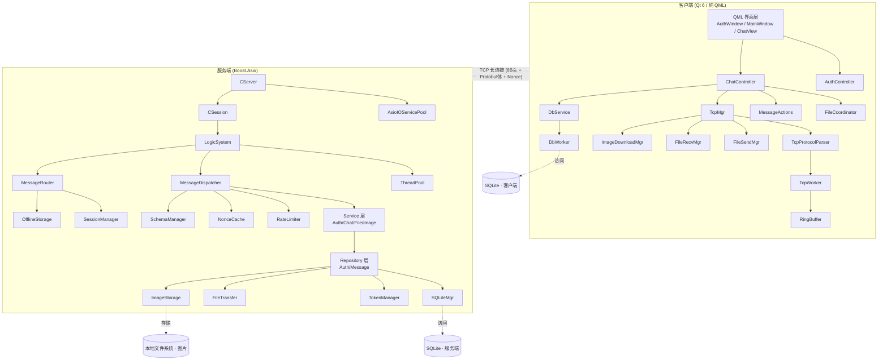

# msrChat — 基于 Qt/Boost.Asio 的即时通讯系统

<p align="center">
  
  
  
  
  
  
  
  
  <a href="https://github.com/shuair/msrChat/actions"></a>
</p>

---

## 项目简介

**msrChat** 是一个即时通讯（IM）系统，采用 **C++17** 标准开发。客户端使用 **Qt 6（纯 QML 界面）**，服务端基于 **Boost.Asio** 异步网络库，通信协议使用 **Protobuf** 序列化，客户端与服务端通过单一 TCP 长连接通信。

服务端内置用户认证（邮箱注册/登录/重置密码），使用 **SQLite** 存储用户与消息数据，支持文件传输（含图片）和离线消息。客户端本地也使用 SQLite 进行消息持久化。

### 核心功能

| 功能 | 说明 |
|------|------|
| **用户认证** | 邮箱验证码注册、SHA256+盐值密码登录、Token 鉴权、重置密码 |
| **消息收发** | 文本/图片消息、消息已读回执（ACK）、撤回（2 分钟窗口）、编辑、离线消息分页拉取 |
| **文件传输** | 分块传输（64KB/chunk）、断点续传（offset 恢复）、MD5 完整性校验 |
| **图片传输** | 上传/下载管线、缩略图+原图存储、全屏 ImageViewer（缩放/旋转/翻页）、7 天过期清理 |
| **心跳保活** | 客户端定时 ping/pong（15s 间隔，45s 超时），超时自动重连 |
| **自动重连** | TCP 断线指数退避重连（3s → 6s → 12s → ... → 60s） |
| **本地持久化** | 客户端 SQLite 聊天记录存取，服务端用户/消息/Token 持久化 |
| **过载防护** | 服务端限流（RateLimiter）、连接数上限、防重放（NonceCache） |
| **Schema 治理** | 统一错误码枚举、消息类型枚举、Schema 版本号向前/向后兼容 |

---

## 快速开始（Quick Start）

在 Linux 上一键启动只需三步：

```bash
# 1. 启动服务端
cd server/ChatServer && bash build.sh

# 2. 启动客户端（另开终端）
cd client/QmsrChat && bash build.sh

# 3. 打开两个客户端实例，注册账号 → 添加好友 → 开始聊天
```

详细步骤见下方的 [安装指南](#安装指南) 和 [使用示例](#使用示例)。

---

## 系统架构



### 客户端架构（三层分离）

```
┌──────────────────────────────────────────────────────────┐
│                      QML 界面层                           │
│  AuthWindow / LoginView / RegisterView / ResetView        │
│  MainWindow / ChatView / ChatWindow                       │
│  ChatHeader / MessageInputArea / FileProgressPanel         │
│  MessageDelegate / MessageBubble / ImageBubble             │
│  ImagePreviewBar / EmptyState / ErrorBanner                │
│  ImageViewer / MessageActionMenu / EditMessageDialog       │
│  CardTopAccent / AuthBanner / AuthCardHeader / PasswordField│
└──────────────────────┬───────────────────────────────────┘
                       │ 信号/槽
┌──────────────────────▼───────────────────────────────────┐
│                   C++ 业务控制器层                          │
│  AuthController    ChatController    UserMgr               │
│  FileCoordinator   MessageActions    ChatListModel         │
│  DbService         ImageDownloadMgr FileSendMgr FileRecvMgr│
└──────────────────────┬───────────────────────────────────┘
                       │ 信号/槽
┌──────────────────────▼───────────────────────────────────┐
│                   C++ 网络通信层                            │
│  TcpMgr → TcpProtocolParser → TcpWorker (独立线程)         │
│                   RingBuffer                               │
└──────────────────────────────────────────────────────────┘
```

### 服务端架构（四层 + Service/Repository）

```
┌──────────────────────────────────────────────────┐
│              网络 I/O 层 (AsioIOServicePool)       │
│   CServer (acceptor) → CSession (会话管理)        │
│   RateLimiter (限流) + NonceCache (防重放)         │
└──────────────────────┬───────────────────────────┘
                       │ PostTask
┌──────────────────────▼───────────────────────────┐
│           业务调度层 (LogicSystem + ThreadPool)     │
└──────────────────────┬───────────────────────────┘
                       │ Dispatch
┌──────────────────────▼───────────────────────────┐
│           消息分发层 (MessageDispatcher)            │
│   根据 msg_id 分发 + 鉴权检查 + SchemaManager      │
└──────────────────────┬───────────────────────────┘
                       │
┌──────────────────────▼───────────────────────────┐
│              Service 层 (业务逻辑)                  │
│  AuthService    ChatService                       │
│  FileService    ImageService                      │
└──────────────────────┬───────────────────────────┘
                       │
┌──────────────────────▼───────────────────────────┐
│           Repository 层 (数据访问)                  │
│  AuthRepository      MessageRepository             │
│  TokenManager        SQLiteMgr                     │
│  MessageRouter       OfflineStorage                │
│  FileTransfer        ImageStorage                  │
│  SessionManager                                    │
└──────────────────────────────────────────────────┘
```

---

## 目录结构

```
msrChat/
├── client/                              # Qt 客户端
│   └── QmsrChat/
│       ├── include/                     # C++ 头文件 (19 个)
│       │   ├── AuthController.h         #   认证控制器 (QML 可调用)
│       │   ├── ChatController.h         #   聊天业务控制器
│       │   ├── FileCoordinator.h        #   文件传输协调器
│       │   ├── MessageActions.h         #   消息操作封装 (撤回/编辑/删除)
│       │   ├── ChatListModel.h          #   QAbstractListModel (QML 数据模型)
│       │   ├── TcpMgr.h                 #   TCP 连接管理器
│       │   ├── TcpWorker.h              #   TCP 通信核心 (独立线程)
│       │   ├── TcpProtocolParser.h      #   协议解析分发
│       │   ├── RingBuffer.h             #   环形缓冲区 (64KB~4MB)
│       │   ├── FileSendMgr.h            #   文件发送管理
│       │   ├── FileRecvMgr.h            #   文件接收管理
│       │   ├── ImageDownloadMgr.h       #   图片下载管线
│       │   ├── DbService.h              #   数据库服务接口
│       │   ├── DbWorker.h               #   数据库异步工作线程
│       │   ├── UserMgr.h                #   用户数据管理
│       │   ├── Global.h                 #   全局常量 & 枚举
│       │   ├── ProtocolStructs.h        #   协议结构体
│       │   ├── Utils.h                  #   工具函数
│       │   ├── singleton.h              #   CRTP 单例模板
│       │   └── DPIHelper.h              #   DPI 辅助
│       ├── src/                         # C++ 源文件 (16 个)
│       ├── tests/                       # 单元测试 (3 个)
│       ├── qml/                        # QML 界面文件 (21 个)
│       │   ├── AuthWindow.qml           #   认证窗口 (无边框, 376×540px)
│       │   ├── LoginView.qml            #   登录视图
│       │   ├── RegisterView.qml         #   注册视图 (邮箱验证码)
│       │   ├── ResetView.qml            #   重置密码视图
│       │   ├── MainWindow.qml           #   主窗口 (StackView 页面切换)
│       │   ├── ChatView.qml             #   核心聊天视图 (组合层, <250行)
│       │   ├── ChatWindow.qml           #   聊天窗口容器
│       │   ├── ChatHeader.qml           #   聊天顶部栏
│       │   ├── MessageInputArea.qml      #   消息输入区域 (工具栏+TextArea)
│       │   ├── MessageDelegate.qml      #   消息项委托 (ListView delegate)
│       │   ├── MessageBubble.qml        #   文字消息气泡
│       │   ├── ImageBubble.qml          #   图片消息气泡
│       │   ├── ImageViewer.qml          #   全屏图片查看器
│       │   ├── MessageActionMenu.qml    #   消息右键操作菜单
│       │   ├── EditMessageDialog.qml    #   消息编辑对话框
│       │   ├── FileProgressPanel.qml    #   文件传输进度面板 (右上角浮层)
│       │   ├── ImagePreviewBar.qml      #   图片预览条
│       │   ├── EmptyState.qml           #   空状态引导层
│       │   ├── CardTopAccent.qml        #   卡片顶部装饰条
│       │   ├── AuthBanner.qml           #   认证页面 Banner
│       │   ├── AuthCardHeader.qml       #   认证卡片标题
│       │   └── PasswordField.qml        #   密码输入框组件
│       ├── resources/                   # 平台资源 (图标等)
│       ├── image/                       # 图标文件
│       ├── style/                       # QSS 样式表
│       │   └── stylesheet.qss           #   Indigo 主题全局样式
│       ├── config.ini.example           # 客户端配置模板
│       ├── build.sh                     # Linux 一键构建脚本
│       └── CMakeLists.txt               # 客户端 CMake 构建
├── server/                              # 服务端
│   └── ChatServer/
│       ├── include/                     # C++ 头文件 (24 个)
│       │   ├── CServer.h                #   TCP 服务器入口
│       │   ├── CSession.h               #   单会话管理 (strand 串行化)
│       │   ├── AsioIOServicePool.h      #   I/O 上下文池 (Boss-Worker)
│       │   ├── LogicSystem.h            #   业务逻辑调度
│       │   ├── MessageDispatcher.h      #   消息分发 + 鉴权
│       │   ├── MessageRouter.h          #   消息路由 (在线/离线)
│       │   ├── SessionManager.h         #   在线会话管理 (ShardedMap)
│       │   ├── SQLiteMgr.h              #   SQLite 连接池 (8 连接)
│       │   ├── AuthRepository.h         #   认证数据访问层
│       │   ├── MessageRepository.h      #   消息数据访问层
│       │   ├── TokenManager.h           #   Token 管理
│       │   ├── OfflineStorage.h         #   离线消息存储
│       │   ├── FileTransfer.h           #   文件传输核心
│       │   ├── ImageStorage.h           #   图片存储管理
│       │   ├── RateLimiter.h            #   消息频率限流器
│       │   ├── NonceCache.h             #   防重放 Nonce 缓存
│       │   ├── SchemaManager.h          #   Protobuf Schema 版本兼容
│       │   ├── ThreadPool.h             #   通用线程池
│       │   ├── ShardedMap.h             #   分片哈希表 (32 分片)
│       │   ├── ObjectPool.h             #   对象池 (SendNode/RecvNode)
│       │   ├── const.h                  #   消息 ID 常量
│       │   ├── CSingleton.h             #   线程安全单例基类
│       │   └── ...                      #   其他辅助头文件
│       ├── src/                         # C++ 源文件 (21 个)
│       │   ├── services/                #   Service 层实现
│       │   │   ├── AuthService.cpp
│       │   │   ├── ChatService.cpp
│       │   │   ├── FileService.cpp
│       │   │   └── ImageService.cpp
│       │   └── ...                      #   其他源文件
│       ├── tests/                       # 单元测试 (4 个)
│       ├── config.ini.example           # 服务端配置模板
│       ├── build.sh                     # Linux 一键构建脚本
│       └── CMakeLists.txt               # 服务端 CMake 构建
├── proto/                               # Protobuf 协议定义 (双端共享)
│   └── Message.proto                    #   统一协议文件 (含 ErrorCode/MsgType 枚举)
├── docs/                                # 项目文档
│   ├── architecture-design.md           #   系统架构设计文档
│   └── ...                              #   其他技术文档
├── .github/workflows/                   # CI/CD
│   └── ci.yml                           #   GitHub Actions (Linux + Windows)
├── scripts/                             # 辅助脚本
│   └── asan_benchmark.py                #   AddressSanitizer 基准测试
├── .clang-format                        # Google 风格代码格式化
├── .gitignore                           # Git 忽略规则
├── AGENTS.md                            # AI Agent 操作指引 (GitNexus)
├── CLAUDE.md                            # AI 开发规范
└── README.md
```

---

## 技术栈

| 类别 | 技术 | 说明 |
|------|------|------|
| **语言** | C++17 | Lambda、智能指针、atomic、string_view、optional |
| **网络** | Boost.Asio | 异步 I/O、strand、steady_timer、post |
| **序列化** | Protobuf 3 | 消息序列化与反序列化、enum 定义、Schema 版本管理 |
| **数据库** | SQLite3 | 嵌入式，WAL 事务，8 连接池（服务端） |
| **客户端 UI** | Qt 6 Quick/QML | 纯 QML 页面（21 个组件），StackView + fade 过渡 |
| **客户端网络** | Qt Network (QTcpSocket) | 独立线程 + moveToThread |
| **日志** | spdlog | 服务端/客户端统一异步日志 |
| **加密** | OpenSSL | SHA256 密码哈希 + 随机盐值、HMAC 签名 |
| **JSON** | nlohmann_json | 配置解析 |
| **测试** | Google Test | 单元测试框架 |
| **构建** | CMake 3.16+ | 跨平台构建，支持 MSVC/GCC/Clang |
| **CI/CD** | GitHub Actions | Linux + Windows 双平台自动构建测试 |
| **分析** | GitNexus | 代码智能，符号索引（2224 symbols, 56 execution flows） |

---

## 安装指南

### 1. 环境要求

| 依赖 | 最低版本 | 说明 |
|------|----------|------|
| **C++ 编译器** | GCC 9+ / MSVC 2019+ / Clang 10+ | 需要 C++17 支持 |
| **CMake** | 3.15+ (服务端) / 3.16+ (客户端) | |
| **Qt** | 6.2+ | Core, Network, Quick, Qml, Sql, QuickControls2, QuickLayouts |
| **Boost** | 1.70+ | system, thread 组件 |
| **Protobuf** | 3.x | 含 protoc 编译器 |
| **SQLite3** | 3.x | |
| **OpenSSL** | 1.1+ | |
| **spdlog** | 1.x | |
| **nlohmann_json** | 3.x | |

### 2. 安装依赖

#### Ubuntu / Debian

```bash
# 基础构建工具
sudo apt update
sudo apt install build-essential cmake git

# 服务端依赖
sudo apt install libboost-all-dev libsqlite3-dev libprotobuf-dev protobuf-compiler
sudo apt install libssl-dev libspdlog-dev nlohmann-json3-dev

# 客户端依赖 (Qt 6)
sudo apt install qt6-base-dev qt6-declarative-dev \
                 qt6-tools-dev qt6-tools-dev-tools \
                 libqt6sql6-sqlite libqt6network6
```

#### CentOS / RHEL / Fedora

```bash
# 基础构建工具
sudo dnf install gcc-c++ cmake git

# 服务端依赖
sudo dnf install boost-devel sqlite-devel protobuf-devel protobuf-compiler
sudo dnf install openssl-devel spdlog-devel json-devel

# 客户端依赖 (Qt 6)
sudo dnf install qt6-qtbase-devel qt6-qtdeclarative-devel
```

#### macOS (Homebrew)

```bash
# 基础工具
brew install cmake git

# 服务端依赖
brew install boost sqlite3 protobuf openssl spdlog nlohmann-json

# 客户端依赖
brew install qt@6
```

#### Windows

**方式一：使用 Qt Creator + vcpkg（推荐）**

1. 安装 [Visual Studio 2022](https://visualstudio.microsoft.com/)（含 "使用 C++ 的桌面开发" 工作负载）
2. 安装 [Qt 6.2+](https://www.qt.io/download)（在线安装器选择 MSVC 套件）
3. 安装 [CMake](https://cmake.org/download/)（≥ 3.16）
4. 安装 vcpkg 管理 C++ 库：

```powershell
# 安装 vcpkg
git clone https://github.com/Microsoft/vcpkg.git C:\vcpkg
cd C:\vcpkg
.\bootstrap-vcpkg.bat

# 安装服务端依赖
.\vcpkg install boost-asio boost-system boost-thread sqlite3 protobuf openssl spdlog nlohmann-json --triplet x64-windows
```

**方式二：使用 MSYS2 / MinGW**

```bash
# 基础工具
pacman -S mingw-w64-x86_64-cmake mingw-w64-x86_64-gcc git

# 服务端依赖
pacman -S mingw-w64-x86_64-boost mingw-w64-x86_64-sqlite3 \
         mingw-w64-x86_64-protobuf mingw-w64-x86_64-openssl \
         mingw-w64-x86_64-spdlog mingw-w64-x86_64-nlohmann-json

# 客户端依赖 (Qt 6)
pacman -S mingw-w64-x86_64-qt6-base mingw-w64-x86_64-qt6-declarative
```

### 3. 生成 Protobuf 代码

Protobuf 代码由 CMake 在构建时**自动生成**（通过 `protobuf_generate_cpp`），无需手动操作。

协议定义位于 `proto/Message.proto`（项目根目录），**客户端与服务端共用同一份定义**。CMake 构建时会自动调用 `protoc` 生成 `.pb.h` 和 `.pb.cc` 文件。

如需手动重新生成：

```bash
protoc --cpp_out=. proto/Message.proto
```

### 4. 配置

构建前需要创建配置文件：

```bash
# 服务端
cp server/ChatServer/config.ini.example server/ChatServer/config.ini
# 编辑 config.ini 设置端口、日志等

# 客户端
cp client/QmsrChat/config.ini.example client/QmsrChat/config.ini
# 编辑 config.ini 设置服务器地址和端口
```

**服务端默认配置 (`server/ChatServer/config.ini`)**：

```ini
[ChatServer]
Port = 8080               # 监听端口
DbPath = chatserver.db    # 数据库文件路径
PoolSize = 8              # SQLite 连接池大小
MaxConnections = 10000    # 最大并发连接
RateLimitPerSec = 10      # 每秒消息限制数
RateLimitBurst = 20       # 突发消息限制数
```

**客户端默认配置 (`client/QmsrChat/config.ini`)**：

```ini
[ChatServer]
host = 127.0.0.1          # 服务器 IP
port = 8080               # 服务器端口
```

### 5. 编译

#### 方式 A：使用 build.sh 一键构建（推荐，Linux）

**编译服务端：**

```bash
cd server/ChatServer
bash build.sh
```

编译产物：`server/ChatServer/build/ChatServer`

**编译客户端：**

```bash
cd client/QmsrChat
bash build.sh
```

编译产物：`client/QmsrChat/build/QmsrChat`

`build.sh` 脚本会自动创建构建目录、配置 CMake、编译项目并复制配置文件到输出目录。可通过 `BUILD_TYPE` 环境变量指定构建类型：

```bash
BUILD_TYPE=Debug bash build.sh   # Debug 模式（含 AddressSanitizer）
BUILD_TYPE=Release bash build.sh # Release 模式（默认）
```

服务端还支持 `--clean` 参数清理旧的构建目录：

```bash
bash build.sh --clean
```

#### 方式 B：手动 CMake 构建

**编译服务端：**

```bash
cd server/ChatServer
mkdir -p build && cd build
cmake .. -DCMAKE_BUILD_TYPE=Release
cmake --build . --config Release -j$(nproc)
```

编译产物：`build/ChatServer` (Linux/macOS) 或 `build/Release/ChatServer.exe` (Windows MSVC)

可选：编译并运行单元测试

```bash
cmake .. -DCMAKE_BUILD_TYPE=Debug -DBUILD_TESTS=ON
cmake --build . --config Debug -j$(nproc)
ctest --output-on-failure
```

**编译客户端：**

```bash
cd client/QmsrChat
mkdir -p build && cd build
cmake .. -DCMAKE_BUILD_TYPE=Release
cmake --build . --config Release -j$(nproc)
```

编译产物：`build/QmsrChat` (Linux) 或 `build/QmsrChat.app` (macOS)

**Windows（使用 Qt Creator）：**

1. 打开 Qt Creator
2. `File → Open File or Project...` → 选择 `client/QmsrChat/CMakeLists.txt`
3. 选择 MSVC 构建套件，点击 "Configure Project"
4. 按 `Ctrl+B` 构建

编译产物：`build/Desktop_Qt_6_X_MSVC2022_64bit-Release/QmsrChat.exe`

**编译并运行客户端测试：**

```bash
cd client/QmsrChat/build
ctest --output-on-failure
# 或单独运行
./QmsrChatTests
```

---

## 使用示例

### 启动服务端

```bash
# 方式一：使用编译产物
cd server/ChatServer/build
./ChatServer

# 方式二：使用构建脚本（自动编译+运行）
cd server/ChatServer && bash build.sh && cd build && ./ChatServer
```

预期输出：

```
[2026-06-08 10:00:00.000] [INFO] [1234] ChatServer starting on port 8080...
[2026-06-08 10:00:00.001] [INFO] [1234] Thread pool initialized with N threads
[2026-06-08 10:00:00.002] [INFO] [1234] Database initialized successfully
[2026-06-08 10:00:00.002] [INFO] [1234] Server is listening on 0.0.0.0:8080
```

### 启动客户端

```bash
cd client/QmsrChat/build
./QmsrChat     # Linux/macOS
QmsrChat.exe   # Windows
```

客户端启动后会弹出**认证窗口**（无边框紫色渐变主题，376×540px），包含登录、注册、重置密码三个页面。

### 基本工作流

#### 1. 注册账号

1. 启动客户端，进入 **注册页面**（`RegisterView.qml`）
2. 输入邮箱地址 → 点击 "获取验证码"
3. 输入收到的验证码、用户名和密码
4. 点击 "注册" → 成功后自动跳转到登录页面

```
[注册] → 填写邮箱 → 获取验证码 → 输入验证码 + 用户名 + 密码 → 注册成功 → 自动跳转登录页
```

#### 2. 登录

1. 在 **登录页面**（`LoginView.qml`）输入 **UID**（注册成功后显示的编号）和密码
2. 点击 "登录"
3. 成功后进入主界面（`MainWindow.qml`），TCP 长连接建立，进入聊天视图

```
[登录] → 输入 UID + 密码 → 登录成功 → 进入聊天主界面
```

#### 3. 添加好友与聊天

1. 在主界面搜索框中输入对方的 **UID**
2. 点击添加好友 → 等待对方确认（需对方也启动客户端并在线）
3. 从好友列表选择对方 → 进入聊天窗口（`ChatView.qml`）
4. 在输入框中输入文本消息，按回车发送

**消息交互流程：**

```
用户 A (客户端)                  服务端                    用户 B (客户端)
    |                              |                          |
    |--- MSG_ID_CHAT_TEXT -------->|                          |
    |                              |--- MSG_ID_CHAT_TEXT ----->|
    |                              |                          |
    |<-- MSG_ID_CHAT_ACK ---------|                          |
    |                              |<-- MSG_ID_CHAT_ACK ------|
    |                              |                          |
```

#### 4. 发送文件和图片

**发送文件：**
1. 在聊天窗口中点击 "文件" 按钮
2. 选择本地文件
3. 系统自动分块传输（64KB/chunk），显示实时进度条
4. 支持断点续传：如传输中断，下次传输从断点继续

**发送图片：**
1. 在聊天窗口中点击 "图片" 按钮
2. 选择本地图片（支持常见格式）
3. 图片自动上传 → 以缩略图形式显示在聊天流中（`ImageBubble.qml`）
4. 点击缩略图可打开 ImageViewer（`ImageViewer.qml`）查看原图，支持缩放、旋转、翻页和另存为

#### 5. 消息操作

| 操作 | 入口 | 说明 |
|------|------|------|
| **撤回消息** | 右键消息气泡 → 选择 "撤回" | 已读回执机制确保状态同步 |
| **编辑消息** | 右键消息气泡 → 选择 "编辑" | 弹出 `EditMessageDialog.qml`，修改后重新发送 |
| **查看已读状态** | 消息气泡右下角 | 显示 "已读✓✓" / "未读✓" 标识 |
| **回复引用** | 右键消息气泡 → "回复" | 引用原消息快速回复 |
| **复制文本** | 右键消息气泡 → "复制" | 复制消息文本到剪贴板 |
| **另存为** | 右键消息气泡 → "另存为" | 保存文件到本地（仅文件/图片消息） |
| **删除消息** | 右键消息气泡 → "删除" | 从本地聊天记录删除 |

右键操作菜单由 `MessageActionMenu.qml` 实现，支持最多 6 项操作。

### 多客户端测试

```bash
# 终端 1：启动服务端
./ChatServer

# 终端 2：启动客户端 A
./QmsrChat

# 终端 3：启动客户端 B
./QmsrChat
```

- 客户端 A 注册用户 → 获得 UID（如 10001）
- 客户端 B 注册用户 → 获得 UID（如 10002）
- 互相添加好友后即可互通消息

---

## 测试

### 运行单元测试

项目使用 Google Test 框架，包含服务端和客户端两套测试。

**服务端测试：**

```bash
cd server/ChatServer/build
# 配置时需开启测试
cmake .. -DBUILD_TESTS=ON
cmake --build .
ctest --output-on-failure
```

服务端测试覆盖：

| 测试文件 | 测试内容 |
|----------|----------|
| `test_ShardedMap.cpp` | 多分片哈希表并发读写正确性 |
| `test_ThreadPool.cpp` | 线程池任务提交与执行 |
| `test_ImageStorage.cpp` | 图片存储/缩放/格式转换 |
| `test_AuthFlow.cpp` | 认证流程端到端测试（注册→登录→Token） |
| `test_MessageOps.cpp` | 消息操作测试（发送/撤回/编辑/离线） |
| `stress_image_upload.cpp` | 图片上传压力测试 |

**客户端测试：**

```bash
cd client/QmsrChat/build
ctest --output-on-failure
```

客户端测试覆盖：

| 测试文件 | 测试内容 |
|----------|----------|
| `test_RingBuffer.cpp` | 环形缓冲区读写与自动扩容 |
| `test_ChatListModel.cpp` | QAbstractListModel 数据操作 |
| `test_ImageDownloadMgr.cpp` | 图片下载管线正确性 |

### 手动功能验证

建议依次验证以下流程：

1. 编译通过：`cmake --build .` 无错误
2. 启动服务端：日志输出正常，无异常退出
3. 启动客户端：UI 正常显示，认证窗口无破损
4. 注册 → 登录 → 发送文本消息 → 发送图片 → 发送文件 → 撤回消息 → 编辑消息
5. 断网测试：客户端自动重连，消息不丢失
6. 离线消息：B 离线时 A 发送消息，B 上线后收到离线消息

---

## 协议格式

### 二进制帧结构

```
+----------+-------------+-------------------+
| MsgID(2B)| BodyLen(4B) | Protobuf Body     |
+----------+-------------+-------------------+
| 大端序    | 大端序       | Message.proto 序列化 |
+----------+-------------+-------------------+
```

- **MsgID**: 2 字节无符号整数，标识消息类型（大端序）
- **BodyLen**: 4 字节无符号整数，标识 Protobuf 数据体长度（大端序，单包最大 1MB）
- **Body**: Protobuf 序列化后的消息体，含 NonceHeader 防重放字段

### 消息类型 (MsgType 枚举)

协议定义位于 `proto/Message.proto`，客户端与服务端共用同一份定义。使用 Protobuf `enum MsgType` 统一编号。

| MsgID | 枚举名 | 说明 | 方向 |
|-------|--------|------|------|
| 1000 | `MSG_ID_HELLO` | 心跳 ping/pong | 双向 |
| 1001 | `MSG_ID_GET_VERIFY_CODE` | 获取邮箱验证码 | C→S |
| 1002 | `MSG_ID_REGISTER_USER` | 用户注册 | C→S |
| 1003 | `MSG_ID_RESET_PWD` | 重置密码 | C→S |
| 1004 | `MSG_ID_LOGIN_USER` | 用户登录 | C→S |
| 1005 | `MSG_ID_CHAT_LOGIN` | 聊天会话认证（Token） | C→S |
| 1006 | `MSG_ID_CHAT_TEXT` | 文本消息（含 Nonce） | 双向 |
| 1007 | `MSG_ID_CHAT_ACK` | 消息确认 | 双向 |
| 1008 | `MSG_ID_OFFLINE_ACK` | 离线消息分页确认 | C→S |
| 1009 | `MSG_ID_CHAT_IMAGE` | 图片消息（含缩略图元数据） | 双向 |
| 1010 | `MSG_ID_IMAGE_DOWNLOAD_RSP` | 图片下载响应（分片） | S→C |
| 1011 | `MSG_ID_CHAT_RECALL` | 撤回消息请求 | C→S |
| 1012 | `MSG_ID_CHAT_EDIT` | 编辑消息请求 | C→S |
| 1013 | `MSG_ID_IMAGE_DOWNLOAD_REQ` | 图片下载请求 | C→S |
| 1014 | `MSG_ID_CHAT_RECALL_NOTIFY` | 撤回通知广播 | S→C |
| 1015 | `MSG_ID_CHAT_EDIT_NOTIFY` | 编辑通知广播 | S→C |
| 2001 | `MSG_ID_FILE_REQ` | 文件传输请求（含 MD5/offset） | C→S |
| 2002 | `MSG_ID_FILE_RSP` | 文件传输响应（断点续传） | S→C |
| 2003 | `MSG_ID_FILE_CHUNK` | 文件数据分片（64KB） | 双向 |
| 2004 | `MSG_ID_FILE_ACK` | 数据块接收确认 | 双向 |

### 统一错误码 (ErrorCode 枚举)

所有协议响应统一使用 `ErrorCode` 枚举（定义于 `proto/Message.proto`）：

| 错误码 | 枚举名 | 说明 |
|--------|--------|------|
| 0 | `ERR_SUCCESS` | 成功 |
| 1001 | `ERR_PARSE_ERROR` | 消息解析失败 |
| 1002 | `ERR_INVALID_PARAM` | 参数校验失败 |
| 1003 | `ERR_VERIFY_EXPIRED` | 验证码过期 |
| 1004 | `ERR_VERIFY_WRONG` | 验证码错误 |
| 1005 | `ERR_USER_EXIST` | 用户已存在 |
| 1006 | `ERR_PASSWD_ERR` | 密码错误 |
| 1007 | `ERR_USER_NOT_EXIST` | 用户不存在 |
| 1008 | `ERR_EMAIL_NOT_MATCH` | 邮箱不匹配 |
| 1013 | `ERR_KICKED` | 被另一设备踢出 |
| 1014 | `ERR_BUSY` | 服务器繁忙/限流 |
| 1015 | `ERR_RATE_LIMITED` | 消息频率超限 |
| 4001 | `ERR_RECALL_TIMEOUT` | 超过 2 分钟无法撤回 |
| 4002 | `ERR_RECALL_NOT_OWNER` | 非本人消息无法撤回 |
| 4003 | `ERR_EDIT_TIMEOUT` | 超过 2 分钟无法编辑 |
| 4004 | `ERR_EDIT_NOT_OWNER` | 非本人消息无法编辑 |
| 4005 | `ERR_EDIT_TOO_LONG` | 编辑内容超长（>2000字符） |
| 4006 | `ERR_MSG_ALREADY_RECALLED` | 消息已撤回 |
| 4040 | `ERR_IMAGE_EXPIRED` | 图片已过期（7天） |

### Schema 版本兼容

每条消息携带 `schema_version` 字段（Proto 字段号 7/11），`SchemaManager` 负责向前/向后兼容校验。当前 Schema 版本 = 1。

### 防重放机制

关键写操作（注册、重置密码、聊天消息、撤回、编辑）的请求消息均携带 `NonceHeader`：
- `nonce`: 客户端生成的 UUID v4
- `timestamp`: 毫秒级时间戳
- `signature`: HMAC-SHA256 签名（防篡改）

服务端 `NonceCache` 缓存已处理的 nonce，拒绝重复请求。

### 文件传输流程

```
发送端                          接收端                          协议 (<MsgID>)
  |                               |                             |
  |--- MSG_ID_FILE_REQ ---------->|  (task_id, filename, size)  2001
  |<-- MSG_ID_FILE_RSP -----------|  (task_id, offset=0 Ready)  2002
  |                               |                             |
  |-- MSG_ID_FILE_CHUNK (0,64KB)->|                              2003
  |<-- MSG_ID_FILE_ACK -----------|  (task_id, received=64KB)   2004
  |                               |                             |
  |-- MSG_ID_FILE_CHUNK (64KB,...)>|                              2003
  ... 循环直到发完 ...            |                             |
  |                               |                             |
  |<-- MSG_ID_FILE_ACK (complete)-|                              2004
```

---

## 核心模块详解

### 客户端核心组件

#### QML 界面层

| QML 文件 | 功能 |
|----------|------|
| `AuthWindow.qml` | 无边框认证窗口（376×540px），StackView 管理 Login/Register/Reset 三页切换 |
| `LoginView.qml` | 登录视图 — UID/密码输入，渐变紫色主题 |
| `RegisterView.qml` | 注册视图 — 邮箱+验证码两步注册，倒计时按钮 |
| `ResetView.qml` | 重置密码视图 — 邮箱验证后设置新密码 |
| `MainWindow.qml` | 主窗口 — StackView 页面切换 + fade 动画过渡 |
| `ChatView.qml` | 核心聊天视图（组合层，<250 行） |
| `ChatWindow.qml` | 聊天窗口容器 |
| `ChatHeader.qml` | 聊天顶部栏 — 对方信息 + 状态指示 |
| `MessageInputArea.qml` | 消息输入区域 — TextArea + 工具栏（文件/图片/表情） |
| `MessageDelegate.qml` | 消息项委托 — 根据类型选择 MessageBubble 或 ImageBubble |
| `MessageBubble.qml` | 文字消息气泡 — 己方蓝底/对方白底，支持撤回/编辑/已读状态 |
| `ImageBubble.qml` | 图片消息气泡 — 缩略图 + caption + 加载/失败占位 |
| `ImageViewer.qml` | 全屏图片查看器 — 缩放/旋转/翻页/另存为 |
| `MessageActionMenu.qml` | 右键操作菜单 — 回复/复制/撤回/编辑/另存为/删除 |
| `EditMessageDialog.qml` | 消息编辑对话框（modal） |
| `FileProgressPanel.qml` | 文件传输进度面板（右上角浮层，实时进度+速度） |
| `ImagePreviewBar.qml` | 图片预览条（发送前预览） |
| `EmptyState.qml` | 空状态引导层 — "开始聊天" 引导 |
| `CardTopAccent.qml` | 卡片顶部渐变装饰条 |
| `AuthBanner.qml` | 认证页面 Banner — 渐变背景+Logo |
| `AuthCardHeader.qml` | 认证卡片标题 — 标题+副标题 |
| `PasswordField.qml` | 密码输入框组件 — 显隐切换+强度指示 |

#### C++ 业务层

| 组件 | 文件 | 说明 |
|------|------|------|
| **AuthController** | `AuthController.h/.cpp` | 认证业务控制器 — 登录/注册/重置密码，QML 可调用接口 |
| **ChatController** | `ChatController.h/.cpp` | 聊天业务控制器 — 消息收发/撤回/编辑/历史路由 |
| **FileCoordinator** | `FileCoordinator.h/.cpp` | 文件传输协调器 — 统一管理 FileSendMgr 和 FileRecvMgr |
| **MessageActions** | `MessageActions.h/.cpp` | 消息操作封装 — 撤回/编辑/删除操作的状态和参数校验 |
| **TcpMgr** | `TcpMgr.h/.cpp` | TCP 连接管理器（单例），对外暴露连接管理接口 |
| **TcpWorker** | `TcpWorker.h/.cpp` | TCP 通信核心，独立线程运行（moveToThread），含 RingBuffer 和心跳 |
| **TcpProtocolParser** | `TcpProtocolParser.h/.cpp` | 协议解析分发，分离登录/聊天双路径消息处理 |
| **RingBuffer** | `RingBuffer.h` | 环形缓冲区，自动扩容（64KB ~ 4MB） |
| **FileSendMgr** | `FileSendMgr.h/.cpp` | 文件发送管理，分块发送（64KB/chunk）+ 断点续传 |
| **FileRecvMgr** | `FileRecvMgr.h/.cpp` | 文件接收管理，临时文件 + rename 机制 + MD5 校验 |
| **ImageDownloadMgr** | `ImageDownloadMgr.h/.cpp` | 图片下载管线管理 + LRU 缓存 + 重试（最多 3 次） |
| **DbService** | `DbService.h/.cpp` | 数据库服务接口，信号驱动 DbWorker |
| **DbWorker** | `DbWorker.h/.cpp` | SQLite 数据库操作工作线程 |
| **ChatListModel** | `ChatListModel.h/.cpp` | QAbstractListModel 子类，供 QML ListView 使用 |
| **UserMgr** | `UserMgr.h/.cpp` | 用户数据管理（单例） |
| **Utils** | `Utils.h/.cpp` | 工具函数（字符串处理、密码哈希等） |

### 服务端核心组件

| 组件 | 文件 | 说明 |
|------|------|------|
| **CServer** | `CServer.h/.cpp` | TCP 服务器入口，管理连接接入和会话生命周期 |
| **AsioIOServicePool** | `AsioIOServicePool.h/.cpp` | I/O 上下文池（Boss-Worker 模式），多线程处理网络事件 |
| **CSession** | `CSession.h/.cpp` | 单会话管理，协议解析（6 字节头 + Protobuf body），strand 串行化 |
| **LogicSystem** | `LogicSystem.h/.cpp` | 业务逻辑入口，通过 ThreadPool 异步处理 MessageTask |
| **MessageDispatcher** | `MessageDispatcher.h/.cpp` | 消息处理器注册表，根据 msg_id 分发，支持鉴权检查 |
| **MessageRouter** | `MessageRouter.h/.cpp` | 消息路由，在线转发 / 离线存储 |
| **SessionManager** | `SessionManager.h/.cpp` | 用户会话管理器，ShardedMap 多分片并发读写 |
| **SQLiteMgr** | `SQLiteMgr.h/.cpp` | SQLite 连接池（8 连接），RAII 管理，支持优雅关闭 |
| **AuthService** | `services/AuthService.cpp` | 认证业务服务 — 登录/注册/重置密码/Token 签发 |
| **ChatService** | `services/ChatService.cpp` | 聊天业务服务 — 消息收发/撤回/编辑/离线消息 |
| **FileService** | `services/FileService.cpp` | 文件业务服务 — 文件传输请求/响应/分片路由 |
| **ImageService** | `services/ImageService.cpp` | 图片业务服务 — 图片上传/下载请求路由 |
| **AuthRepository** | `AuthRepository.h/.cpp` | 认证数据访问 — 用户 CRUD、密码验证 |
| **MessageRepository** | `MessageRepository.h/.cpp` | 消息数据访问 — 消息存储/查询/标记状态 |
| **TokenManager** | `TokenManager.h/.cpp` | Token 生成与验证/持久化 |
| **OfflineStorage** | `OfflineStorage.h/.cpp` | 离线消息存储与批量发送（shared_mutex） |
| **FileTransfer** | `FileTransfer.h/.cpp` | 文件传输核心，分块传输和断点续传 |
| **ImageStorage** | `ImageStorage.h/.cpp` | 图片存储管理，缩略图生成，7 天过期清理 |
| **RateLimiter** | `RateLimiter.h/.cpp` | 消息频率限流器 — 按 UID 分桶计数 |
| **NonceCache** | `NonceCache.h` | 防重放缓存 — LRU 淘汰已处理 nonce |
| **SchemaManager** | `SchemaManager.h/.cpp` | Protobuf Schema 版本兼容管理 |
| **ThreadPool** | `ThreadPool.h/.cpp` | 通用任务线程池，固定线程数 |
| **ShardedMap** | `ShardedMap.h` | 多分片哈希表模板（32 分片），高并发读写 |
| **ObjectPool** | `ObjectPool.h` | 对象池模板，SendNode/RecvNode 复用，减少内存分配 |

### 客户端 TcpWorker — 心跳与重连

TcpWorker 在独立线程中运行（`moveToThread`），负责 TCP 连接、协议解析、心跳和重连：

```cpp
class TcpWorker : public QObject {
    QTcpSocket *_socket;
    RingBuffer _recv_buffer;
    QTimer *_heartbeat_timer;     // 15s ping
    QTimer *_pong_check_timer;    // 5s 检查 pong
    QTimer *_reconnect_timer;     // 指数退避重连
    qint64 _last_pong_time;
    int _reconnect_interval;      // 3s → 6s → 12s → ... → 60s
};
```

| 定时器 | 间隔 | 功能 |
|--------|------|------|
| `_heartbeat_timer` | 15 秒 | 发送 MSG_HELLO (ping) |
| `_pong_check_timer` | 5 秒 | 检查是否收到 pong，超 45 秒则重连 |
| `_reconnect_timer` | 指数退避 | 断线重连（3s → 6s → 12s → ... → 60s） |

### 服务端消息处理链路

```
CSession::AsyncReadHead()
    → AsyncReadBody()
    → CSession::HandleMessage()
    → LogicSystem::PostTask(MessageTask)
    → ThreadPool::enqueue()
    → LogicSystem::ProcessTask()
    → MessageDispatcher::Dispatch()
        → RateLimiter 检查 → NonceCache 校验 → SchemaManager 兼容检查
        → Service 层 (Auth/Chat/File/Image)
            → Repository 层 (Auth/Message) → SQLiteMgr
```

### MessageDispatcher（消息分发 + 安全防护）

```cpp
class MessageDispatcher {
    // handler 注册表，每个 msg_id 注册一个 Service + 鉴权标记
    std::unordered_map<uint16_t, HandlerInfo> _handlers;

    bool Dispatch(CSession &session, uint16_t msg_id, const std::string &body_data) {
        // 1. 限流检查 (RateLimiter)
        if (_rate_limiter.IsLimited(session.GetUserUid(), msg_id)) return false;

        // 2. 防重放检查 (NonceCache，仅写操作)
        if (_nonce_cache.HasNonce(extract_nonce(body_data))) return false;

        // 3. Schema 兼容检查 (SchemaManager)
        if (!_schema_manager.IsCompatible(extract_schema_version(body_data))) return false;

        auto it = _handlers.find(msg_id);
        if (it == _handlers.end()) return false;

        // 4. 鉴权检查
        const auto &info = it->second;
        if (info.requires_auth && session.GetUserUid() == 0) return false;

        // 5. 分发到 Service 层
        return info.service(session, body_data);
    }
};
```

### RingBuffer 防溢出

```cpp
// 环形缓冲区，自动扩容（64KB ~ 4MB）
class RingBuffer {
    static constexpr size_t kDefaultCapacity = 64 * 1024;
    static constexpr size_t kMaxCapacity = 4 * 1024 * 1024;

    std::unique_ptr<char[]> _buffer;
    std::atomic<size_t> _read_pos;
    std::atomic<size_t> _write_pos;
};
```

---

## CI/CD

项目通过 GitHub Actions 自动化构建与测试。

### Workflow (`.github/workflows/ci.yml`)

| Job | 平台 | 构建内容 | 触发条件 |
|-----|------|---------|---------|
| `server-linux` | Ubuntu | ChatServer + 测试（含 gtest） | push/PR to main, new |
| `server-windows` | Windows | ChatServer（MSVC + vcpkg） | push/PR to main, new |
| `client-ringbuffer-test` | Ubuntu | RingBuffer 单元测试（最小依赖） | push/PR to main, new |

**CI 环境依赖自动安装：** Boost.Asio、SQLite3、Protobuf、spdlog、nlohmann_json、OpenSSL。

### 本地 CI 模拟

```bash
# 模拟 server-linux job
cd server/ChatServer
cmake -B build -DCMAKE_BUILD_TYPE=Release -DBUILD_TESTS=ON
cmake --build build --target ChatServerTests -j$(nproc)
cd build && ctest --output-on-failure

# 模拟 client-ringbuffer-test job
g++ -std=c++17 \
  -I client/QmsrChat/include \
  client/QmsrChat/tests/test_RingBuffer.cpp \
  -lgtest -lgtest_main -lpthread \
  -o test_ringbuffer
./test_ringbuffer
```

---

## 系统安全

| 措施 | 实现 |
|------|------|
| 密码存储 | SHA-256 + 随机盐值（`Utils::hashPassword`） |
| 会话鉴权 | 登录后生成 Token，后续操作需 Token 校验 |
| Token 持久化 | 内存缓存 + 数据库持久化，服务端重启不丢失 |
| 防篡改 | HMAC-SHA256 签名（NonceHeader.signature） |
| 防重放 | NonceCache LRU 缓存已处理 nonce，拒绝重复请求 |
| 速率限制 | RateLimiter 按 UID + msg_id 分桶限流 |
| 消息验证 | 撤回/编辑需验证所有权 + 2 分钟时间窗口 |
| Schema 兼容 | SchemaManager 检查消息版本，向前/向后兼容 |
| 连接安全 | 读超时（30s）+ CAS 防并发 + strand 串行化 |

---

## 调试

### 服务端日志（spdlog）

```cpp
// 设置日志级别
spdlog::set_level(spdlog::level::debug);
spdlog::set_pattern("[%Y-%m-%d %H:%M:%S.%e] [%^%L%$] [%t] %v");

// 关键日志点
spdlog::info("[CServer] Server listening on port {}", port);
spdlog::info("[CSession] New session {} connected", uuid);
spdlog::debug("[LogicSystem] Processing msg_id={} for session {}", msg_id, uuid);
spdlog::info("[MessageRouter] Forwarding message to uid={}", target_uid);
```

### 客户端日志（spdlog + qDebug）

```cpp
// spdlog 封装宏
LOG_INFO("TcpWorker::slot_connected: connected to server");
LOG_DEBUG("TcpWorker::ParseMessages: msg_id={}, body_len={}", msg_id, body_len);
LOG_WARN("TcpWorker: heartbeat timeout, reconnecting...");
```

### 常见问题

**Q: 编译失败，提示找不到 Boost**

```bash
# Ubuntu/Debian
sudo apt install libboost-all-dev

# CentOS/RHEL
sudo dnf install boost-devel

# macOS (Homebrew)
brew install boost

# Windows (vcpkg)
vcpkg install boost-asio boost-system boost-thread --triplet x64-windows
```

**Q: Protobuf 编译错误**

```bash
# 确保安装了 protobuf-compiler
sudo apt install protobuf-compiler libprotobuf-dev

# 检查 protoc 版本
protoc --version  # 应输出类似 "libprotoc 3.x"
```

**Q: 客户端显示"连接成功"但无法收发消息**

检查是否收到服务端的聊天认证响应（`MSG_CHAT_LOGIN_RSP`），未认证的连接只能发送登录/注册指令。查看服务端日志确认认证状态。

**Q: 文件传输失败**

1. 检查服务端和客户端 Protobuf 定义是否一致（`Message.proto`）
2. 确认网络连接正常
3. 查看服务端日志中的文件传输详细输出

**Q: 数据库锁定**

```bash
# 检查是否有进程占用数据库
lsof server/ChatServer/chatserver.db

# 删除 WAL 模式残留文件（如有）
rm -f server/ChatServer/chatserver.db-shm server/ChatServer/chatserver.db-wal
```

**Q: 客户端窗口显示异常 / 布局错乱**

确保 Qt 6 包完整安装，特别是 `qt6-declarative-dev` 和 `qt6-quickcontrols2-dev`。如果使用缩放显示器，检查 DPI 设置：

```bash
# 设置 Qt 缩放因子
export QT_SCALE_FACTOR=1
export QT_AUTO_SCREEN_SCALE_FACTOR=0
```

---

## 贡献指南

我们欢迎所有形式的贡献！无论是报告 Bug、提出新功能建议，还是提交代码 PR。

### 行为准则

- 尊重所有贡献者，保持友善和建设性的沟通
- 在 Issue 和 PR 中清晰描述问题和方案
- 遵循项目的代码规范和架构设计原则

### 如何贡献

#### 报告 Bug

1. 在 [Issues](https://github.com/your-repo/msrChat/issues) 中搜索是否已有相同问题
2. 使用 Bug 报告模板，包含以下信息：
   - **环境信息**：操作系统、编译器版本、Qt/Boost/Protobuf 版本
   - **重现步骤**：清晰描述如何触发该 Bug
   - **期望行为 vs 实际行为**
   - **日志输出**：附上服务端/客户端的相关日志片段
   - **截图**（如适用，界面问题务必附带截图）

#### 提出功能建议

1. 先搜索现有 Issues 确认未重复
2. 描述功能的使用场景和价值
3. 如有技术方案设想，欢迎一起讨论

#### 提交代码

**1. Fork & 克隆**

```bash
git clone <your-fork-url> msrChat
cd msrChat
git remote add upstream <upstream-repo-url>
```

**2. 创建特性分支**

```bash
# 分支命名规范
git checkout -b feature/<简短描述>     # 新功能
git checkout -b fix/<简短描述>          # Bug 修复
git checkout -b refactor/<简短描述>     # 重构
git checkout -b docs/<简短描述>         # 文档
```

示例：

```bash
git checkout -b feature/group-chat
git checkout -b fix/heartbeat-timeout
```

**3. 开发**

- **代码风格**：项目根目录有 `.clang-format` 配置文件（Google 风格，120 列宽），提交前必须格式化代码：

```bash
# 格式化单个文件
clang-format -i <file.cpp>

# 格式化所有修改的 C++ 文件
git diff --name-only | grep -E '\.(cpp|h)$' | xargs clang-format -i
```

- **Qt 元对象**：如果修改了含 `Q_OBJECT` 的头文件，确保 CMakeLists.txt 中已添加对应文件路径，CMake 的 `AUTOMOC` 会自动处理

- **Protobuf 修改**：如果修改了 `proto/Message.proto`，重新生成后需同时更新客户端和服务端的 Protobuf 代码：

```bash
protoc --cpp_out=. proto/Message.proto
# 将生成的 .pb.h 和 .pb.cc 复制到客户端和服务端各自的构建目录
```

- **QML 修改**：修改 QML 文件后（`client/QmsrChat/*.qml`），无需重新编译即可通过 Qt Quick 的热加载预览变化（Qt Creator 中按 `Ctrl+R` 刷新）

- **编写测试**：
  - 新功能必须包含单元测试（使用 Google Test）
  - Bug 修复应包含回归测试
  - 测试文件放在：
    - 客户端：`client/QmsrChat/tests/`
    - 服务端：`server/ChatServer/tests/`

- **文档更新**：
  - 如果修改了公开 API 或核心逻辑，更新相应的文档注释
  - 如果新增了 QML 文件或 C++ 模块，更新本 README 的 [核心模块详解](#核心模块详解) 表格
  - 如果修改了协议消息，更新 [协议格式](#协议格式) 章节

**4. 提交（Commit）**

```bash
# 提交前验证编译
cd build && cmake --build . --config Debug

# 运行测试
ctest --output-on-failure

# 提交
git add .
git commit -m "<type>: <简短描述>"
```

**Commit 消息规范：**

格式：`<type>: <描述>`

| Type | 用途 | 示例 |
|------|------|------|
| `feat` | 新功能 | `feat: 添加群聊功能` |
| `fix` | Bug 修复 | `fix: 修复心跳超时后不重连的问题` |
| `refactor` | 代码重构（不改变功能） | `refactor: 将 TcpProtocolParser 拆分为独立模块` |
| `docs` | 文档更新 | `docs: 完善 README 安装指南` |
| `test` | 添加或修改测试 | `test: 补充 RingBuffer 边界条件测试` |
| `style` | 代码风格调整（格式化等） | `style: 统一 Allman 大括号风格` |
| `perf` | 性能优化 | `perf: 优化 ShardedMap 并发读写性能` |
| `chore` | 构建/工具/依赖变更 | `chore: 更新 Google Test 至 1.15.2` |

**5. 创建 Pull Request**

1. 推送分支到你的 Fork
2. 在 GitHub 上创建 PR，关联相关 Issue（如 `Closes #123`）
3. 在 PR 描述中说明：
   - **做了什么改动**
   - **为什么这样做**
   - **如何测试这些改动**
   - **关联的 Issue 编号**

**6. Code Review**

- 至少需要一位维护者 Review 通过
- CI 必须全部通过（编译 + 测试）
- 根据 Review 意见修改后，使用 `git commit --amend` 或追加新 commit
- 合并方式：合并到 `main` 分支（Squash & Merge 或 Rebase & Merge）

### AI Agent 开发规范

本项目集成了 **GitNexus** 代码智能工具，AI 辅助开发时请遵循以下规范（详见 `AGENTS.md`）：

| 原则 | 说明 |
|------|------|
| **计划先行** | 所有任务必须先有 plan 文件，定义阶段和验证标准 |
| **阶段验证** | 每阶段完成后必须编译测试，通过后进入下一阶段 |
| **影响分析** | 修改任何函数/类/方法前，运行 `npx gitnexus impact` 检查影响范围 |
| **变更检测** | 提交前运行 `npx gitnexus detect-changes` 确认只影响预期符号 |
| **代码审查** | 高/严重风险项必须在修改前向开发者预警 |
| **禁止跳过验证** | 任何"完成"声明都必须有编译通过证据 |

### 开发环境配置（IDE）

**推荐使用 Qt Creator**（客户端开发）：

1. 打开 `client/QmsrChat/CMakeLists.txt`
2. 选择构建套件（MSVC / GCC / Clang）
3. 在 "项目" 设置中配置 CMake 参数（如 `-DCMAKE_BUILD_TYPE=Debug`）
4. 按 F5 调试运行

**VS Code**（服务端开发）：

1. 安装 C/C++、CMake Tools 扩展
2. 打开项目根目录
3. 选择 `server/ChatServer/CMakeLists.txt` 进行配置
4. 构建目标选择 `ChatServer`

---

## 许可证

本项目基于 [MIT License](https://opensource.org/licenses/MIT) 开源。

---

## 联系方式

欢迎通过 GitHub Issues 提交 Bug 反馈或功能建议。
