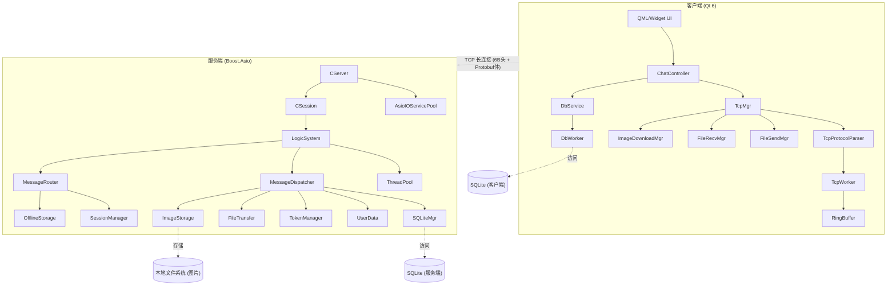

# msrChat — 基于 Qt/Boost.Asio 的即时通讯系统

<p align="center">
  
  
  
  
  
  
</p>

---

## 项目简介

**msrChat** 是一个即时通讯（IM）系统，采用 **C++17** 标准开发。客户端使用 **Qt 6**（含 QML），服务端基于 **Boost.Asio** 异步网络库，通信协议使用 **Protobuf** 序列化，客户端与服务端通过单一 TCP 长连接通信。

服务端内置用户认证（注册/登录/重置密码），使用 **SQLite** 存储用户与消息数据，支持文件传输（含图片）和离线消息。客户端本地也使用 SQLite 进行消息持久化。

### 核心功能

| 功能 | 说明 |
|------|------|
| **用户认证** | 注册（邮箱验证码）、登录（SHA256）、重置密码 |
| **消息收发** | 文本消息、图片消息、离线消息分页拉取、消息已读回执（ACK）、消息撤回与编辑 |
| **文件传输** | 分块传输、断点续传、MD5 校验 |
| **图片传输** | 上传/下载管线、缩略图+原图存储、ImageViewer 查看器 |
| **心跳检测** | 客户端定时 ping/pong（15s 间隔，45s 超时），超时自动重连 |
| **自动重连** | 连接断开后指数退避重连（3s → 6s → … → 60s） |
| **本地消息存储** | 客户端 SQLite 持久化聊天记录 |

---

## 系统架构



---

## 目录结构

```
msrChat/
├── client/                              # Qt 客户端
│   └── QmsrChat/
│       ├── include/                     # 头文件
│       ├── src/                         # 源文件
│       ├── ui/                          # Qt Designer UI 文件
│       ├── tests/                       # 客户端单元测试
│       ├── proto/                       # Protobuf 定义
│       ├── resources/                   # 平台资源 (图标等)
│       ├── ChatView.qml                 # QML 主聊天视图
│       ├── MessageBubble.qml            # QML 消息气泡
│       ├── ImageBubble.qml              # QML 图片气泡
│       ├── ImageViewer.qml              # QML 图片查看器
│       ├── config.ini.example           # 客户端配置模板
│       └── CMakeLists.txt
├── server/                              # 服务端
│   └── ChatServer/
│       ├── include/                     # 头文件
│       │   └── Protocol/               #   协议抽象层
│       ├── src/                         # 源文件
│       ├── tests/                       # 服务端单元测试
│       ├── proto/                       # Protobuf 定义
│       ├── config.ini.example           # 服务端配置模板
│       └── CMakeLists.txt
├── docs/                                # 项目文档
│   └── superpowers/
│       ├── plans/                       # 开发计划
│       └── specs/                       # 设计规格 & 进度报告
├── scripts/                             # 辅助脚本
├── .clang-format                        # 代码格式化规则
├── .gitignore
├── AGENTS.md                            # AI Agent 操作指引
├── CLAUDE.md                            # Claude Code 项目指引
└── README.md
```

---

## 技术栈

| 类别 | 技术 | 说明 |
|------|------|------|
| **语言** | C++17 | Lambda、智能指针、atomic、string_view |
| **网络** | Boost.Asio | 异步 I/O、strand、steady_timer |
| **序列化** | Protobuf | 消息序列化与反序列化 |
| **数据库** | SQLite3 | 嵌入式，事务支持，连接池 |
| **客户端** | Qt 6 | Widgets + Quick/QML、Network、Sql |
| **日志** | spdlog | 服务端/客户端统一日志 |
| **加密** | OpenSSL | SHA256 密码哈希 |
| **JSON** | nlohmann_json | 配置解析 |
| **测试** | Google Test | 单元测试框架 |
| **构建** | CMake | 跨平台构建，支持 MSVC/GCC/Clang |

---

## 安装指南

### 1. 环境要求

| 依赖 | 最低版本 | 说明 |
|------|----------|------|
| **C++ 编译器** | GCC 9+ / MSVC 2019+ / Clang 10+ | 需要 C++17 支持 |
| **CMake** | 3.15+ (服务端) / 3.16+ (客户端) | |
| **Qt** | 6.2+ | Widgets, Network, Quick, Qml, Sql, QuickWidgets, QuickControls2, QuickLayouts |
| **Boost** | 1.70+ | system, thread 组件 |
| **Protobuf** | 3.x | 含 protoc 编译器 |
| **SQLite3** | 3.x | |
| **OpenSSL** | 1.1+ | |
| **spdlog** | 1.x | 推荐使用系统包管理器安装 |
| **nlohmann_json** | 3.x | |

### 2. 安装依赖

#### Ubuntu / Debian

```bash
# 基础构建工具
sudo apt update
sudo apt install build-essential cmake git

# 服务端依赖
sudo apt install libboost-all-dev libsqlite3-dev libprotobuf-dev protobuf-compiler
sudo apt install libssl-dev libspdlog-dev nlohmann-json3-dev

# 客户端依赖 (Qt 6)
sudo apt install qt6-base-dev qt6-declarative-dev \
                 qt6-tools-dev qt6-tools-dev-tools \
                 libqt6sql6-sqlite libqt6network6
```

#### CentOS / RHEL / Fedora

```bash
# 基础构建工具
sudo dnf install gcc-c++ cmake git

# 服务端依赖
sudo dnf install boost-devel sqlite-devel protobuf-devel protobuf-compiler
sudo dnf install openssl-devel spdlog-devel json-devel

# 客户端依赖 (Qt 6)
sudo dnf install qt6-qtbase-devel qt6-qtdeclarative-devel
```

#### macOS (Homebrew)

```bash
# 基础工具
brew install cmake git

# 服务端依赖
brew install boost sqlite3 protobuf openssl spdlog nlohmann-json

# 客户端依赖
brew install qt@6
```

#### Windows

**方式一：使用 Qt Creator（推荐）**

1. 安装 [Qt 6.2+](https://www.qt.io/download)（在线安装器选择 MSVC 套件）
2. 安装 [Visual Studio 2022](https://visualstudio.microsoft.com/)（含 "使用 C++ 的桌面开发" 工作负载）
3. 安装 [CMake](https://cmake.org/download/)（≥ 3.16）
4. 安装 vcpkg 管理 C++ 库：

```powershell
# 安装 vcpkg
git clone https://github.com/Microsoft/vcpkg.git C:\vcpkg
cd C:\vcpkg
.\bootstrap-vcpkg.bat

# 安装服务端依赖
.\vcpkg install boost-asio boost-system boost-thread sqlite3 protobuf openssl spdlog nlohmann-json --triplet x64-windows
```

**方式二：使用 MSYS2 / MinGW**

```bash
# 基础工具
pacman -S mingw-w64-x86_64-cmake mingw-w64-x86_64-gcc git

# 服务端依赖
pacman -S mingw-w64-x86_64-boost mingw-w64-x86_64-sqlite3 \
         mingw-w64-x86_64-protobuf mingw-w64-x86_64-openssl \
         mingw-w64-x86_64-spdlog mingw-w64-x86_64-nlohmann-json

# 客户端依赖 (Qt 6)
pacman -S mingw-w64-x86_64-qt6-base mingw-w64-x86_64-qt6-declarative
```

### 4. 生成 Protobuf 代码

Protobuf 代码由 CMake 在构建时自动生成（通过 `protobuf_generate_cpp`），无需手动操作。

协议定义位于：
- `client/QmsrChat/proto/Message.proto`（客户端与服务端使用同一份 proto 定义）
- CMake 构建时会自动调用 `protoc` 生成 `.pb.h` 和 `.pb.cc` 文件

如需手动重新生成：

```bash
protoc --cpp_out=. proto/Message.proto
```

### 5. 配置

构建前需要创建配置文件：

```bash
# 服务端
cp server/ChatServer/config.ini.example server/ChatServer/config.ini
# 编辑 config.ini 设置端口、日志等

# 客户端
cp client/QmsrChat/config.ini.example client/QmsrChat/config.ini
# 编辑 config.ini 设置服务器地址和端口
```

**服务端默认配置 (`server/ChatServer/config.ini`)**：

```ini
[ChatServer]
Port = 8080               # 监听端口
ThreadPoolSize = 0        # 线程池大小 (0=自动, 即 CPU 核心数)
MaxConnections = 1000     # 最大并发连接
DebugMode = 1             # 调试模式

[Log]
Level = INFO              # 日志级别: DEBUG / INFO / WARNING / ERROR
File = ./logs/chatserver.log
Console = 1               # 是否输出到控制台
```

**客户端默认配置 (`client/QmsrChat/config.ini`)**：

```ini
[ChatServer]
host = 127.0.0.1          # 服务器 IP
port = 8080               # 服务器端口
```

### 6. 编译

#### 编译服务端

```bash
cd server/ChatServer
mkdir -p build && cd build
cmake .. -DCMAKE_BUILD_TYPE=Release
cmake --build . --config Release -j$(nproc)
```

编译产物：`build/ChatServer` (Linux/macOS) 或 `build/Release/ChatServer.exe` (Windows MSVC)

可选：编译并运行单元测试

```bash
cmake .. -DCMAKE_BUILD_TYPE=Debug -DBUILD_TESTS=ON
cmake --build . --config Debug -j$(nproc)
ctest --output-on-failure
```

#### 编译客户端

**Linux / macOS：**

```bash
cd client/QmsrChat
mkdir -p build && cd build
cmake .. -DCMAKE_BUILD_TYPE=Release
cmake --build . --config Release -j$(nproc)
```

编译产物：`build/QmsrChat` (Linux) 或 `build/QmsrChat.app` (macOS)

**Windows（使用 Qt Creator）：**

1. 打开 Qt Creator
2. `File → Open File or Project...` → 选择 `client/QmsrChat/CMakeLists.txt`
3. 选择 MSVC 构建套件，点击 "Configure Project"
4. 按 `Ctrl+B` 构建

编译产物：`build/Desktop_Qt_6_X_MSVC2022_64bit-Release/QmsrChat.exe`

#### 编译并运行客户端测试

```bash
cd client/QmsrChat/build
ctest --output-on-failure
# 或单独运行
./QmsrChatTests
```

---

## 使用示例

### 启动服务端

```bash
cd server/ChatServer/build
./ChatServer
```

预期输出：

```
[INFO] ChatServer starting on port 8080...
[INFO] Thread pool initialized with N threads
[INFO] Database initialized successfully
[INFO] Server is listening on 0.0.0.0:8080
```

### 启动客户端

```bash
cd client/QmsrChat/build
./QmsrChat     # Linux/macOS
QmsrChat.exe   # Windows
```

### 基本工作流

#### 1. 注册账号

1. 启动客户端，进入 **注册页面**
2. 输入邮箱地址 → 点击 "获取验证码"
3. 输入收到的验证码、用户名和密码
4. 点击 "注册"，成功后自动跳转到登录页面

```
[注册] → 填写邮箱 → 获取验证码 → 输入验证码 + 用户名 + 密码 → 注册成功
```

#### 2. 登录

1. 在 **登录页面** 输入 UID（注册成功后显示）和密码
2. 点击 "登录"
3. 成功后进入主界面，TCP 长连接建立

#### 3. 添加好友和聊天

1. 在主界面搜索框中输入对方的 UID
2. 点击添加好友 → 等待对方确认
3. 从好友列表选择对方 → 进入聊天窗口
4. 在输入框中输入文本消息，按回车发送

#### 4. 发送文件和图片

**发送文件：**
1. 在聊天窗口中点击 "文件" 按钮
2. 选择本地文件
3. 系统自动分块传输（64KB/chunk），并显示进度条
4. 支持断点续传：如传输中断，下次传输从断点继续

**发送图片（客户端支持）：**
1. 在聊天窗口中点击 "图片" 按钮
2. 选择本地图片（支持常见格式）
3. 图片自动上传 → 以缩略图形式显示在聊天流中
4. 点击缩略图可打开 ImageViewer 查看原图

#### 5. 消息操作

- **撤回消息**：右键消息气泡 → "撤回"（已读回执机制确保状态同步）
- **编辑消息**：右键消息气泡 → "编辑" → 修改内容后重新发送
- **查看已读状态**：消息旁显示 "已读"/"未读" 标识

### 多客户端测试

```bash
# 终端 1：启动服务端
./ChatServer

# 终端 2：启动客户端 A
./QmsrChat

# 终端 3：启动客户端 B
./QmsrChat
```

- 客户端 A 注册用户 → 获得 UID（如 10001）
- 客户端 B 注册用户 → 获得 UID（如 10002）
- 互相添加好友后即可互通消息

---

## 测试

### 运行单元测试

项目使用 Google Test 框架，包含服务端和客户端两套测试。

**服务端测试：**

```bash
cd server/ChatServer/build
# 配置时需开启测试
cmake .. -DBUILD_TESTS=ON
cmake --build .
ctest --output-on-failure
```

服务端测试覆盖：
| 测试文件 | 测试内容 |
|----------|----------|
| `test_ShardedMap.cpp` | 多分片哈希表并发读写正确性 |
| `test_ThreadPool.cpp` | 线程池任务提交与执行 |
| `test_ImageStorage.cpp` | 图片存储/缩放/格式转换 |
| `stress_image_upload.cpp` | 图片上传压力测试 |

**客户端测试：**

```bash
cd client/QmsrChat/build
ctest --output-on-failure
```

客户端测试覆盖：
| 测试文件 | 测试内容 |
|----------|----------|
| `test_RingBuffer.cpp` | 环形缓冲区读写与自动扩容 |
| `test_ChatListModel.cpp` | QAbstractListModel 数据操作 |
| `test_ImageDownloadMgr.cpp` | 图片下载管线正确性 |

### 手动功能验证

1. 编译通过：`cmake --build .` 无错误
2. 启动服务端：无异常退出
3. 启动客户端：UI 正常显示
4. 注册 → 登录 → 发送文本消息 → 发送图片 → 发送文件 → 撤回消息 → 编辑消息
5. 断网测试：客户端自动重连，消息不丢失

---

## 协议格式

### 二进制帧结构

```
+----------+-------------+-------------------+
| MsgID(2B)| BodyLen(4B) | Protobuf Body     |
+----------+-------------+-------------------+
| 大端序    | 大端序       | Message.proto 序列化 |
+----------+-------------+-------------------+
```

- **MsgID**: 2 字节无符号整数，标识消息类型（大端序）
- **BodyLen**: 4 字节无符号整数，标识 Protobuf 数据体长度（大端序）
- **Body**: Protobuf 序列化后的消息体

### 消息类型

| MsgID | 常量名 | 说明 | 对应 Protobuf 消息 |
|-------|--------|------|-------------------|
| 1000 | `MSG_HELLO` | 心跳 ping/pong | - |
| 1001 | `ID_GET_VARIFY_CODE` | 获取邮箱验证码 | `VerifyCodeReq` / `VerifyCodeRsp` |
| 1002 | `ID_REGISTER_USER` | 用户注册 | `RegisterReq` / `RegisterRsp` |
| 1003 | `ID_RESET_PWD` | 重置密码 | `ResetPwdReq` / `ResetPwdRsp` |
| 1004 | `ID_LOGIN_USER` | 用户登录 | `LoginReq` / `LoginRsp` |
| 1005 | `MSG_CHAT_LOGIN` | 聊天会话认证 | `ChatLoginReq` / `ChatLoginRsp` |
| 1006 | `MSG_CHAT_TEXT` | 文本消息 | `ChatTextMsg` / `ServerChatMsg` |
| 1007 | `MSG_CHAT_ACK` | 消息确认 | `ChatAck` |
| 1008 | `MSG_OFFLINE_ACK` | 离线消息分页确认 | - |
| 2001 | `MSG_FILE_REQ` | 文件传输请求 | `FileReq` / `FileRsp` |
| 2002 | `MSG_FILE_RSP` | 文件传输响应（断点续传） | `FileRsp` |
| 2003 | `MSG_FILE_CHUNK` | 文件数据分片 | `FileChunk` |
| 2004 | `MSG_FILE_ACK` | 数据块接收确认 | `FileAck` |

### 文件传输流程

```
发送端                          接收端                          协议 (<MsgID>)
  |                               |                             |
  |--- MSG_FILE_REQ ------------->|  (task_id, filename, size)  2001
  |<-- MSG_FILE_RSP --------------|  (task_id, offset=0 Ready)  2002
  |                               |                             |
  |-- MSG_FILE_CHUNK (0, 64KB) -->|                              2003
  |<-- MSG_FILE_ACK --------------|  (task_id, received=64KB)   2004
  |                               |                             |
  |-- MSG_FILE_CHUNK (64KB, ...)->|                              2003
  ... 循环直到发完 ...            |                             |
  |                               |                             |
  |<-- MSG_FILE_ACK (complete) ---|                              2004
```

---

## 核心模块详解

### 客户端核心组件

| 组件 | 文件 | 说明 |
|------|------|------|
| **MainWindow** | `MainWindow.h/.cpp` | 主窗口，管理所有页面切换 |
| **LoginDialog** | `LoginDialog.h/.cpp` | 登录对话框 |
| **RegisterDialog** | `RegisterDialog.h/.cpp` | 注册对话框 |
| **ResetDialog** | `ResetDialog.h/.cpp` | 重置密码对话框 |
| **ChatDialog** | `ChatDialog.h/.cpp` | 聊天窗口 |
| **ChatController** | `ChatController.h/.cpp` | 聊天业务控制器（发送/接收/撤回/编辑消息路由） |
| **TcpMgr** | `TcpMgr.h/.cpp` | TCP 连接管理器，对外暴露连接管理接口 |
| **TcpWorker** | `TcpWorker.h/.cpp` | TCP 通信核心，独立线程运行，含 RingBuffer 和心跳 |
| **TcpProtocolParser** | `TcpProtocolParser.h/.cpp` | 协议解析，分离登录/聊天消息处理 |
| **FileSendMgr** | `FileSendMgr.h/.cpp` | 文件发送管理，分块发送（64KB/chunk） |
| **FileRecvMgr** | `FileRecvMgr.h/.cpp` | 文件接收管理，临时文件 + rename 机制 |
| **ImageDownloadMgr** | `ImageDownloadMgr.h/.cpp` | 图片下载管线管理 |
| **DbService** | `DbService.h/.cpp` | 数据库服务接口，信号驱动 DbWorker |
| **DbWorker** | `DbWorker.h/.cpp` | SQLite 数据库操作工作线程 |
| **RingBuffer** | `RingBuffer.h` | 环形缓冲区，自动扩容（64KB ~ 4MB） |
| **ChatListModel** | `ChatListModel.h/.cpp` | QAbstractListModel 子类，供 QML ListView 使用 |
| **UserMgr** | `UserMgr.h/.cpp` | 用户数据管理 |
| **TimerBtn** | `TimerBtn.h/.cpp` | 验证码倒计时按钮 |
| **ClickedLabel** | `ClickedLabel.h/.cpp` | 可点击状态标签 |

### 服务端核心组件

| 组件 | 文件 | 说明 |
|------|------|------|
| **CServer** | `CServer.h/.cpp` | TCP 服务器入口，管理连接接入和会话生命周期 |
| **AsioIOServicePool** | `AsioIOServicePool.h/.cpp` | I/O 上下文池，多线程处理网络事件 |
| **CSession** | `CSession.h/.cpp` | 单会话管理，协议解析（6字节头 + Protobuf body），支持文件/图片接收状态 |
| **LogicSystem** | `LogicSystem.h/.cpp` | 业务逻辑入口，通过 ThreadPool 异步处理 MessageTask |
| **MessageDispatcher** | `MessageDispatcher.h/.cpp` | 消息处理器注册表，根据 msg_id 分发到对应 handler，支持鉴权检查 |
| **MessageRouter** | `MessageRouter.h/.cpp` | 消息路由，在线转发 / 离线存储 |
| **SessionManager** | `SessionManager.h/.cpp` | 用户会话管理器，ShardedMap 多分片并发读写 |
| **SQLiteMgr** | `SQLiteMgr.h/.cpp` | SQLite 连接池（RAII），支持优雅关闭 |
| **UserData** | `UserData.h/.cpp` | 用户数据操作（注册、登录、密码重置） |
| **TokenManager** | `TokenManager.h/.cpp` | Token 生成与验证 |
| **OfflineStorage** | `OfflineStorage.h/.cpp` | 离线消息存储与批量发送（shared_mutex） |
| **FileTransfer** | `FileTransfer.h/.cpp` | 文件传输核心，分块传输和断点续传 |
| **ImageStorage** | `ImageStorage.h/.cpp` | 图片存储管理，支持缩略图生成和格式转换 |
| **ThreadPool** | `ThreadPool.h/.cpp` | 通用任务线程池，用于业务逻辑异步处理 |
| **ObjectPool** | `ObjectPool.h` | 对象池模板，SendNode/RecvNode 复用 |
| **ShardedMap** | `ShardedMap.h` | 多分片哈希表，高并发读写 |

### 客户端 TcpWorker — 心跳与重连

TcpWorker 在独立线程中运行（`moveToThread`），负责 TCP 连接、协议解析、心跳和重连：

```cpp
class TcpWorker : public QObject {
    QTcpSocket *_socket;
    RingBuffer _recv_buffer;
    QTimer *_heartbeat_timer;     // 15s ping
    QTimer *_pong_check_timer;    // 5s 检查 pong
    QTimer *_reconnect_timer;     // 指数退避重连
    qint64 _last_pong_time;
    int _reconnect_interval;      // 3s → 6s → 12s ... → 60s
};
```

| 定时器 | 间隔 | 功能 |
|--------|------|------|
| `_heartbeat_timer` | 15 秒 | 发送 MSG_HELLO (ping) |
| `_pong_check_timer` | 5 秒 | 检查是否收到 pong，超 45 秒则重连 |
| `_reconnect_timer` | 指数退避 | 断线重连（3s → 6s → 12s ... 60s） |

### 服务端消息处理链路

```
CSession::AsyncReadHead()
    → AsyncReadBody()
    → CSession::HandleMessage()
    → LogicSystem::PostTask(MessageTask)
    → ThreadPool::enqueue()
    → LogicSystem::ProcessTask()
    → MessageDispatcher::Dispatch()
    → 注册的 MessageHandler (handler)
```

### MessageDispatcher (消息分发)

```cpp
class MessageDispatcher {
    // handler 注册表，每个 msg_id 注册一个 handler + 鉴权标记
    std::unordered_map<uint16_t, HandlerInfo> _handlers;

    bool Dispatch(CSession &session, uint16_t msg_id, const std::string &body_data) {
        auto it = _handlers.find(msg_id);
        if (it == _handlers.end()) return false;

        const auto &info = it->second;
        // 鉴权检查：需要登录态的消息，未登录直接拒绝
        if (info.requires_auth && session.GetUserUid() == 0) return false;

        return info.handler(session, body_data);
    }
};
```

### RingBuffer 防溢出

```cpp
// 环形缓冲区，自动扩容（64KB ~ 4MB）
class RingBuffer {
    static constexpr size_t kDefaultCapacity = 64 * 1024;
    static constexpr size_t kMaxCapacity = 4 * 1024 * 1024;

    std::unique_ptr<char[]> _buffer;
    std::atomic<size_t> _read_pos;
    std::atomic<size_t> _write_pos;
};
```

---

## 调试

### 服务端日志（spdlog）

```cpp
// 设置日志级别
spdlog::set_level(spdlog::level::debug);
spdlog::set_pattern("[%Y-%m-%d %H:%M:%S.%e] [%^%L%$] [%t] %v");

// 关键日志点
spdlog::info("[CServer] Server listening on port {}", port);
spdlog::info("[CSession] New session {} connected", uuid);
spdlog::debug("[LogicSystem] Processing msg_id={} for session {}", msg_id, uuid);
spdlog::info("[MessageRouter] Forwarding message to uid={}", target_uid);
```

### 客户端日志（spdlog + qDebug）

```cpp
// spdlog 封装宏 (Logger.h)
LOG_INFO("TcpWorker::slot_connected: connected to server");
LOG_DEBUG("TcpWorker::ParseMessages: msg_id={}, body_len={}", msg_id, body_len);
LOG_WARN("TcpWorker: heartbeat timeout, reconnecting...");
```

### 常见问题

**Q: 编译失败，提示找不到 Boost**

```bash
# Ubuntu/Debian
sudo apt install libboost-all-dev

# CentOS/RHEL
sudo dnf install boost-devel

# macOS (Homebrew)
brew install boost

# Windows (vcpkg)
vcpkg install boost-asio boost-system boost-thread --triplet x64-windows
```

**Q: Protobuf 编译错误**

```bash
# 确保安装了 protobuf-compiler
sudo apt install protobuf-compiler libprotobuf-dev

# 检查 protoc 版本
protoc --version  # 应输出类似 "libprotoc 3.x"
```

**Q: 客户端显示"连接成功"但无法收发消息**

检查是否收到服务端的聊天认证响应（MSG_CHAT_LOGIN_RSP），未认证的连接只能发送登录/注册指令。查看服务端日志确认认证状态。

**Q: 文件传输失败**

1. 检查服务端和客户端 Protobuf 定义是否一致（`Message.proto`）
2. 确认网络连接正常
3. 查看服务端日志中的文件传输详细输出

**Q: 数据库锁定**

```bash
# 检查是否有进程占用数据库
lsof server/ChatServer/chatserver.db

# 删除 WAL 模式残留文件（如有）
rm -f server/ChatServer/chatserver.db-shm server/ChatServer/chatserver.db-wal
```

---

## 贡献指南

我们欢迎所有形式的贡献！无论是报告 Bug、提出新功能建议，还是提交代码 PR。

### 行为准则

- 尊重所有贡献者，保持友善和建设性的沟通
- 在 Issue 和 PR 中清晰描述问题和方案
- 遵循项目的代码规范和架构设计原则

### 如何贡献

#### 报告 Bug

1. 在 Issues 中搜索是否已有相同问题
2. 使用 Bug 报告模板，包含以下信息：
   - **环境信息**：操作系统、编译器版本、Qt/Boost 版本
   - **重现步骤**：清晰描述如何触发该 Bug
   - **期望行为 vs 实际行为**
   - **日志输出**：附上服务端/客户端的相关日志片段
   - **截图**（如适用）

#### 提出功能建议

1. 先搜索现有 Issues 确认未重复
2. 描述功能的使用场景和价值
3. 如有技术方案设想，欢迎一起讨论

#### 提交代码

**1. Fork & 克隆**

```bash
git clone <your-fork-url> msrChat
cd msrChat
git remote add upstream <upstream-repo-url>
```

**2. 创建特性分支**

```bash
# 分支命名规范
git checkout -b feature/<简短描述>     # 新功能
git checkout -b fix/<简短描述>          # Bug 修复
git checkout -b refactor/<简短描述>     # 重构
git checkout -b docs/<简短描述>         # 文档
```

示例：
```bash
git checkout -b feature/group-chat
git checkout -b fix/heartbeat-timeout
```

**3. 开发**

- **代码风格**：项目根目录有 `.clang-format` 配置文件，提交前必须格式化代码：

```bash
# 格式化单个文件
clang-format -i <file.cpp>

# 格式化所有修改的 C++ 文件
git diff --name-only | grep -E '\.(cpp|h)$' | xargs clang-format -i
```

- **Qt 元对象**：如果修改了含 `Q_OBJECT` 的头文件，确保 CMakeLists.txt 中已添加对应文件路径，并触发 AUTOMOC

- **编写测试**：
  - 新功能必须包含单元测试（使用 Google Test）
  - Bug 修复应包含回归测试
  - 测试文件放在 `client/QmsrChat/tests/` 或 `server/ChatServer/tests/` 目录

- **文档更新**：如果修改了公开 API 或核心逻辑，更新相应的文档注释

**4. 提交（Commit）**

```bash
# 提交前验证编译
cd build && cmake --build . --config Debug

# 运行测试
ctest --output-on-failure

# 提交
git add .
git commit -m "<type>: <简短描述>"
```

**Commit 消息规范：**

格式：`<type>: <描述>`

| Type | 用途 |
|------|------|
| `feat` | 新功能 |
| `fix` | Bug 修复 |
| `refactor` | 代码重构（不改变功能） |
| `docs` | 文档更新 |
| `test` | 添加或修改测试 |
| `style` | 代码风格调整（格式化等） |
| `perf` | 性能优化 |
| `chore` | 构建/工具/依赖变更 |

示例：
```
feat: 添加群聊功能
fix: 修复心跳超时后不重连的问题
refactor: 将 TcpProtocolParser 拆分为独立模块
test: 补充 RingBuffer 边界条件测试
docs: 完善 README 安装指南
```

**5. 创建 Pull Request**

1. 推送分支到你的 Fork
2. 在 GitHub 上创建 PR，关联相关 Issue
3. 在 PR 描述中说明：
   - 做了什么改动
   - 为什么这样做
   - 如何测试这些改动
   - 关联的 Issue 编号

**6. Code Review**

- 至少需要一位维护者 Review 通过
- CI 必须全部通过（编译 + 测试）
- 根据 Review 意见修改后，使用 `git commit --amend` 或追加新 commit
- 合并方式：合并到 `main` 分支（Squash & Merge 或 Rebase & Merge）

### 开发环境配置（IDE）

**推荐使用 Qt Creator**（客户端开发）：

1. 打开 `client/QmsrChat/CMakeLists.txt`
2. 选择构建套件
3. 在 "项目" 设置中配置 CMake 参数（如 `-DCMAKE_BUILD_TYPE=Debug`）
4. 按 F5 调试运行

**VS Code**（服务端开发）：

1. 安装 C/C++、CMake Tools 扩展
2. 打开项目根目录
3. 选择 `CMakeLists.txt` 进行配置
4. 构建目标选择 `ChatServer`

### 项目开发规范

本项目遵循以下开发规范（详见 `CLAUDE.md`）：

- **计划先行**：所有任务必须先有 plan 文件，定义阶段和验证标准
- **阶段验证**：每阶段完成后必须编译测试，通过后进入下一阶段
- **代码审查**：修改前后运行 impact analysis，确保不影响其他模块
- **禁止跳过验证**：任何"完成"声明都必须有编译通过证据

---

## 许可证

本项目基于 [MIT License](https://opensource.org/licenses/MIT) 开源。

---

## 联系方式

欢迎通过 GitHub Issues 提交 Bug 反馈或功能建议。
