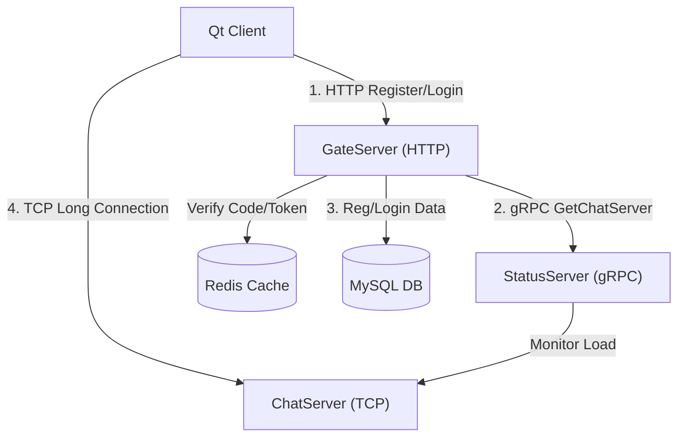

# msrChat (High Performance Distributed Instant Messaging System)

<p align="center">
  
  
  
  
</p>

> **Note**: 本项目采用微服务架构设计，基于 C++17 和 Qt 开发，旨在构建一个高并发、低延迟的分布式即时通讯系统。

---

## 📖 项目简介 (Introduction)

**msrChat** 是一个现代化的分布式即时通讯（IM）系统。

为了解决传统单体架构在海量用户连接下的性能瓶颈，本项目采用了 **微服务架构**，将网关服务、状态服务、业务服务进行拆分。客户端通过 HTTP 协议与网关交互进行注册登录，通过 TCP 长连接与聊天服务器进行实时通信。

后端核心采用 **C++17** 标准，基于 **Boost.Asio** 异步网络库和 **gRPC** 框架，实现了高性能的网络通信和跨服务调用。前端使用 **Qt** 框架，打造了流畅且美观的用户界面。

## 🏗️ 系统架构 (Architecture)



*   **GateServer**: HTTP 网关，负责用户注册、登录、负载均衡。
*   **StatusServer**: 状态服务，维护 ChatServer 集群的健康状态和负载情况。
*   **ChatServer**: TCP 聊天服务器，负责消息推送、即时通讯。
*   **Qt Client**: 跨平台客户端，集成 HTTP 和 TCP 通信模块。

## 📂 目录结构 (Directory Structure)

```
msrChat/
├── client/                 # 客户端源码
│   └── QmsrChat/           # Qt 客户端工程
├── server/                 # 服务端源码
│   ├── GateServer/         # HTTP 网关服务器
│   ├── ChatServer/         # TCP 聊天服务器
│   └── StatusServer/       # gRPC 状态服务器
├── shared/                 # 共享代码
│   └── message.proto       # gRPC & Protobuf 定义文件
├── googletest/             # 单元测试框架
├── logs/                   # 运行日志
└── CMakeLists.txt          # 项目根构建文件
```

## ✨ 核心特性 (Key Features)

*   **⚡ 高性能网络模型**：
    *   **Boost.Asio 异步 I/O**: 基于 Epoll/IOCP 实现非阻塞 I/O，单机支持万级并发。
    *   **IO Context Pool**: 实现多线程 Reactor 模型，通过 `round-robin` 轮询分发连接，充分利用多核 CPU。

*   **🔄 高效通信与协议**：
    *   **gRPC 微服务通信**: 服务间调用采用 gRPC (Protobuf)，比 RESTful API 更高效。
    *   **自定义应用层协议**: TCP 通信采用 "Length-Field" (ID+Length+Data) 封包格式，完美解决粘包/拆包问题。

*   **💾 数据存储与优化**：
    *   **MySQL 连接池**: 基于 `std::queue` 和 `std::condition_variable` 实现的线程安全连接池，支持动态扩容与空闲回收，大幅减少连接建立开销。
    *   **Redis 缓存**: 缓存验证码、Session Token 等高频数据，减轻数据库压力。

*   **🛡️ 工程化实践**：
    *   **RAII 资源管理**: 全面使用智能指针 (`std::shared_ptr`, `std::unique_ptr`) 管理内存和资源，杜绝内存泄漏。
    *   **Singleton 单例模式**: 统一管理全局配置、网络连接池等核心组件。

## 🛠️ 技术栈 (Tech Stack)

| 类别 | 技术 | 说明 |
| :--- | :--- | :--- |
| **语言** | C++17 | 使用 lambda, smart pointers, mutex 等现代特性 |
| **网络** | Boost.Asio, Boost.Beast | 高性能异步网络库 & HTTP 库 |
| **RPC** | gRPC, Protobuf | Google 高性能 RPC 框架 |
| **数据库** | MySQL, Redis | 关系型数据库 & 内存缓存 |
| **客户端** | Qt 5 / Qt 6 | 跨平台 GUI 框架 |
| **构建** | CMake | 跨平台构建系统 |

## 🚀 编译与运行 (Build & Run)

### 1. 依赖项 (Dependencies)

*   **Compiler**: GCC 9+ / Clang 10+ / MSVC 2019+ (C++17 Support)
*   **CMake**: 3.15+
*   **Libraries**:
    *   Boost (system, thread, filesystem)
    *   gRPC & Protobuf
    *   MySQL Connector/C++
    *   hiredis (Redis Client)
    *   Qt 5.12+ (Client only)

### 2. 服务端编译 (Server)

```bash
# 1. 编译 GateServer
cd server/GateServer
mkdir build && cd build
cmake ..
make -j4

# 2. 运行
./GateServer
```

### 3. 客户端编译 (Client)

```bash
cd client/QmsrChat
mkdir build && cd build
cmake ..
make -j4
./QmsrChat
```

## 📄 许可证 (License)

本项目采用 [MIT License](LICENSE) 许可证。
