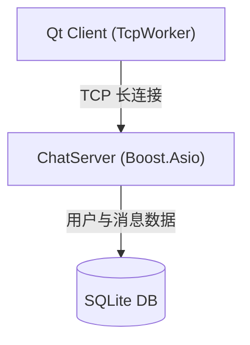

# msrChat (高性能分布式即时通讯系统)

<p align="center">
  
  
  
  
</p>

---

## 项目简介

**msrChat** 是一个现代化的分布式即时通讯（IM）系统，采用 **C++17** 标准开发，客户端使用 **Qt 6**，服务端基于 **Boost.Asio** 异步网络库。

### 核心功能

| 功能 | 说明 |
|------|------|
| **用户认证** | 注册（邮箱验证码）、登录（SHA256）、重置密码 |
| **消息收发** | 文本消息、离线消息存储、消息确认（ACK）机制 |
| **文件传输** | 分块传输、零拷贝（std::string_view）、断点续传、MD5 校验 |
| **心跳检测** | 客户端定时 ping/pong，检测连接存活 |
| **自动重连** | 连接断开后自动尝试重连 |

### 最新优化

- **无锁消息分发**: LogicSystem 移除 mutex，运行时无锁读取
- **高效任务表**: FileTransfer 使用 shared_mutex，支持并发读
- **异步文件传输**: FileSender 用 steady_timer 替代 thread.detach()
- **内存安全**: RingBuffer 改用 unique_ptr，DbWorker 超时放弃手动清理

## 系统架构



## 目录结构

```
msrChat/
├── client/                          # Qt 客户端
│   └── QmsrChat/
│       ├── include/
│       │   ├── TcpWorker.h          # TCP 通信核心
│       │   ├── TcpMgr.h             # TCP 连接管理器
│       │   ├── DbWorker.h           # SQLite 数据库工作线程
│       │   ├── DbMgr.h              # 数据库管理器
│       │   ├── FileSendMgr.h        # 文件发送管理
│       │   ├── FileRecvMgr.h        # 文件接收管理
│       │   ├── RingBuffer.h         # 环形缓冲区
│       │   ├── UserMgr.h            # 用户数据管理
│       │   ├── ProtocolStructs.h    # 协议结构体
│       │   ├── ChatController.h     # 聊天业务控制器
│       │   ├── ChatDialog.h         # 聊天窗口
│       │   ├── MainWindow.h         # 主窗口
│       │   ├── LoginDialog.h        # 登录对话框
│       │   ├── RegisterDialog.h     # 注册对话框
│       │   └── ResetDialog.h        # 重置密码对话框
│       └── src/
├── server/                          # 服务端
│   └── ChatServer/
│       ├── include/
│       │   ├── CServer.h            # TCP 服务器入口
│       │   ├── CSession.h           # 单会话管理
│       │   ├── LogicSystem.h        # 业务逻辑处理
│       │   ├── SQLiteMgr.h          # SQLite 数据库管理
│       │   ├── SessionManager.h     # 会话管理器
│       │   ├── TokenManager.h       # Token 管理器
│       │   ├── OfflineStorage.h     # 离线消息存储
│       │   ├── FileTransfer.h       # 文件传输核心
│       │   ├── ThreadPool.h         # 线程池
│       │   ├── ObjectPool.h         # 对象池
│       │   ├── AsioIOServicePool.h  # Asio I/O 服务池
│       │   └── Protocol/            # 协议实现
│       │       ├── BaseProtocol.h
│       │       ├── TLVProtocol.h    # TLV 粘包解决
│       │       └── BinaryPacketProtocol.h
│       └── src/
├── README.md
└── .gitignore
```

## 技术栈

| 类别 | 技术 | 说明 |
|------|------|------|
| **语言** | C++17 | Lambda、智能指针、atomic、string_view |
| **网络** | Boost.Asio | 异步 I/O、strand、steady_timer |
| **数据库** | SQLite3 | 嵌入式，事务支持 |
| **客户端** | Qt 6 | 跨平台 GUI、网络、数据库 |
| **构建** | CMake | 跨平台构建 |

## 编译与运行

### 依赖项

**服务端:** GCC 9+ / CMake 3.15+ / Boost 1.70+ / SQLite3
**客户端:** Qt 6.2+ / CMake 3.15+ / C++17 编译器

### 服务端编译

```bash
cd server/ChatServer
mkdir -p build && cd build
cmake .. -DCMAKE_BUILD_TYPE=Release
make -j$(nproc)
./ChatServer
```

### 客户端编译

```bash
cd client/QmsrChat
mkdir -p build && cd build
cmake .. -DCMAKE_BUILD_TYPE=Release
make -j$(nproc)
./QmsrChat
```

## 协议格式

### TLV 协议（解决 TCP 粘包）

```
+--------+--------+--------+
|MsgID(2B)|Length(4B)| Data |
+--------+--------+--------+
```

### 消息类型

| MsgID | 功能 |
|-------|------|
| 0x01 | 注册 |
| 0x02 | 登录 |
| 0x03 | 重置密码 |
| 0x04 | 验证码 |
| 0x05 | 聊天认证 |
| 0x06 | 文本消息 |
| 0x07 | 消息确认 |
| 0x10 | 文件传输 |

## 许可证

MIT License