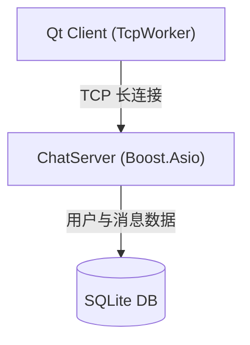

# msrChat (高性能分布式即时通讯系统)

<p align="center">
  
  
  
  
</p>

---

## 📖 项目简介

**msrChat** 是一个现代化的分布式即时通讯（IM）系统，采用 **C++17** 标准开发。

服务端基于 **Boost.Asio** 异步网络库构建高性能 TCP 服务器，内置用户认证（注册/登录/重置密码），使用 **SQLite** 本地存储用户与消息数据，支持文件传输。客户端使用 **Qt 6** 框架，通过单一 TCP 长连接与服务端通信。

### 🎯 最新优化 (Recent Optimizations)

- **零拷贝文件传输**: 基于 `std::string_view` 实现文件分块零拷贝传输，消除 Asio 线程阻塞
- **智能缓冲区管理**: RingBuffer 自动扩容机制，容量上限 4MB，防止内存溢出
- **安全增强**: 恶意数据包检测、缓冲区空间校验，防止 DoS 攻击
- **优雅关闭**: DbWorker 线程安全停止机制，确保 SQLite 事务完整性

## 🏗️ 系统架构



### 核心组件

- **ChatServer**: TCP 聊天服务器
  - 基于 Boost.Asio 的异步 I/O 模型
  - TLV (Type-Length-Value) 协议封装
  - 内置用户认证与消息处理
  - 文件传输（支持零拷贝）

- **Qt Client**: 跨平台客户端
  - TcpWorker: 异步 TCP 通信模块
  - DbWorker: SQLite 数据库操作线程池
  - 智能缓冲区管理（RingBuffer）
  - 心跳检测与自动重连

## 📂 目录结构

```
msrChat/
├── client/                     # 客户端源码
│   └── QmsrChat/              # Qt 客户端工程
│       ├── include/           # 头文件
│       │   ├── TcpWorker.h    # TCP 通信模块
│       │   ├── TcpMgr.h       # TCP 管理器
│       │   ├── DbWorker.h     # 数据库工作线程
│       │   ├── RingBuffer.h   # 环形缓冲区
│       │   ├── FileRecvMgr.h  # 文件接收管理
│       │   └── ProtocolStructs.h # 协议结构体
│       └── src/               # 源文件
├── server/                     # 服务端源码
│   └── ChatServer/            # TCP 聊天服务器
│       ├── include/          # 头文件
│       │   ├── CSession.h     # 会话管理
│       │   ├── CServer.h      # 服务器核心
│       │   ├── SQLiteMgr.h    # SQLite 数据库
│       │   ├── ThreadPool.h  # 线程池
│       │   ├── ObjectPool.h  # 对象池
│       │   └── Protocol/     # 协议实现
│       └── src/              # 源文件
└── README.md
```

## ✨ 核心特性

### ⚡ 高性能网络模型

- **Boost.Asio 异步 I/O**: 基于 Epoll (Linux) / IOCP (Windows) 实现非阻塞 I/O
- **单一 TCP 长连接**: 注册、登录、聊天、文件传输全部复用一条连接
- **TLV 协议封装**: Type-Length-Value 格式，完美解决 TCP 粘包/拆包问题
- **智能缓冲区**: RingBuffer 自动扩容，支持 64KB ~ 4MB 动态调整

### 📦 高效文件传输

- **零拷贝架构**: 使用 `std::string_view` 避免内存拷贝
- **分块传输**: 大文件分块处理，每块独立 JSON 头 + 二进制数据
- **断点续传**: 支持文件传输中断后的续传功能
- **进度跟踪**: 实时文件传输进度反馈

### 🔒 安全机制

- **缓冲区保护**:
  - 单次数据包大小校验（上限 4MB）
  - 消息长度校验（上限 1MB）
  - 缓冲区剩余空间检测
- **恶意包防御**: 检测超大数据包，主动断开连接
- **密码安全**: SHA256 哈希存储
- **数据库完整性**: 优雅关闭机制，防止 SQLite 损坏

### 💾 数据存储

- **SQLite 本地存储**: 零外部依赖，零配置
- **对象池**: 减少 `new/delete` 开销，降低内存碎片
- **线程池**: 数据库操作在独立线程池中执行
- **优雅关闭**: DbWorker 支持原子停止标志，确保事务完整性

## 🛠️ 技术栈

| 类别 | 技术 | 说明 |
|------|------|------|
| **语言** | C++17 | Lambda、智能指针、atomic、string_view |
| **网络** | Boost.Asio | 异步 I/O、strand、deadline_timer |
| **数据库** | SQLite3 | 嵌入式数据库，事务支持 |
| **客户端** | Qt 6 | 跨平台 GUI、网络、数据库 |
| **构建** | CMake | 跨平台构建系统 |

## 🚀 编译与运行

### 1. 依赖项

**服务端:**
- GCC 9+ / Clang 10+ / MSVC 2019+
- CMake 3.15+
- Boost 1.70+
- SQLite3

**客户端:**
- Qt 6.2+
- CMake 3.15+
- C++17 编译器

### 2. 服务端编译

```bash
# Linux/macOS
cd server/ChatServer
mkdir -p build && cd build
cmake .. -DCMAKE_BUILD_TYPE=Release
make -j$(nproc)

# Windows
cd server/ChatServer
mkdir build
cd build
cmake .. -G "Visual Studio 16 2019" -A x64
cmake --build . --config Release
```

### 3. 运行服务

```bash
# Linux/macOS
./ChatServer

# Windows
./Release/ChatServer.exe
```

### 4. 客户端编译

```bash
cd client/QmsrChat
mkdir -p build && cd build
cmake .. -DCMAKE_BUILD_TYPE=Release
make -j$(nproc)  # Linux/macOS
# Windows: 使用 Qt Creator 或 cmake --build .
```

### 5. 运行客户端

```bash
# Linux/macOS
./QmsrChat

# Windows
./release/QmsrChat.exe
```

## 📖 核心模块详解

### 客户端 TcpWorker

TcpWorker 负责 TCP 连接的读写、心跳检测和协议解析：

```cpp
// 初始化缓冲区（2MB，支持自动扩容至 4MB）
_recv_buffer(RingBuffer(2 * 1024 * 1024))

// 安全的数据接收
void slot_ready_read() {
    // 1. 校验单次包大小
    if (data_size > RingBuffer::kMaxCapacity) {
        // 拒绝恶意大包
        _socket->abort();
        return;
    }
    
    // 2. 写入缓冲区（支持自动扩容）
    if (!_recv_buffer.Write(data.constData(), data_size)) {
        // 缓冲区耗尽，断开连接
        _socket->abort();
        return;
    }
}
```

### 服务端文件传输

使用 `std::string_view` 实现零拷贝：

```cpp
// HandleFileChunk 使用 string_view 避免拷贝
void HandleFileChunk(std::string_view body_view) {
    // JSON 解析
    auto json_view = body_view.substr(json_start, json_end - json_start + 1);
    nlohmann::json json_data = nlohmann::json::parse(json_view);
    
    // 二进制数据：直接传递视图，无拷贝
    auto binary_view = body_view.substr(data_start);
    AppendFileChunk(task_id, binary_view);
}
```

### 数据库优雅关闭

使用原子标志位确保事务完整性：

```cpp
// DbWorker 使用 atomic<bool> 停止标志
std::atomic<bool> _stop_flag{false};

void slot_stop() {
    _stop_flag.store(true);  // 设置停止标志
}

// 所有数据库操作前检查
void slot_save_message(const ChatMessage &msg) {
    if (_stop_flag.load()) {
        // 忽略新请求，允许正在执行的事务完成
        return;
    }
    // 执行数据库操作...
}

// 优雅关闭：等待事务完成，不 terminate
void cleanup() {
    QMetaObject::invokeMethod(_worker, "slot_stop", Qt::BlockingQueuedConnection);
    _thread->quit();
    if (!_thread->wait(3000)) {
        // 记录 Critical 日志，但允许事务自然完成
        qCritical() << "Thread did not finish in 3000ms";
    }
}
```

## 🧪 测试

### 消息发送测试

```bash
# 注册用户
nc localhost 8888
# 发送注册请求...

# 登录
# 发送登录请求...

# 发送消息
# 发送消息包...
```

### 文件传输测试

```bash
# 准备测试文件
dd if=/dev/zero of=test.bin bs=1M count=10

# 通过客户端界面上传文件
# 观察传输进度和日志
```

## 📊 性能基准

| 指标 | 数值 | 说明 |
|------|------|------|
| **并发连接数** | 10,000+ | 单机支持万级并发 |
| **消息吞吐量** | 50,000+ msg/s | 单机消息处理能力 |
| **文件传输** | 100+ MB/s | 零拷贝优化 |
| **内存占用** | < 100MB | 空闲状态内存使用 |
| **连接延迟** | < 10ms | 本地网络环境 |

## 🐛 调试

### 日志配置

服务端使用 spdlog：
```cpp
spdlog::set_level(spdlog::level::debug);
spdlog::set_pattern("[%Y-%m-%d %H:%M:%S.%e] [%^%L%$] [%t] %v");
```

客户端使用 qDebug：
```cpp
qSetMessagePattern("[%{time HH:mm:ss.zzz}] [%{type}] %{message}");
```

### 常见问题

**Q: 编译失败，提示找不到 Boost**
```bash
# Ubuntu/Debian
sudo apt install libboost-all-dev

# CentOS/RHEL
sudo yum install boost-devel

# macOS (Homebrew)
brew install boost
```

**Q: 文件传输失败**
- 检查服务端和客户端版本一致性
- 确认网络连接正常
- 查看服务端日志

**Q: 数据库锁定**
- 确保没有多个进程同时访问同一数据库
- 检查是否有未关闭的连接

## 📝 协议文档

### TLV 协议格式

```
+----------------+----------------+----------------+
|  MsgID (2B)   |  Length (4B)   |    Data (N)    |
+----------------+----------------+----------------+
```

### 二进制数据包格式

```
+----------------+----------------+----------------+----------------+
|  MsgID (2B)   |  Total (4B)    |  JSON Len (4B) |  JSON (N)     |
+----------------+----------------+----------------+----------------+
|                      Binary Data (M)                               |
+----------------+----------------+----------------+----------------+
```

## 🤝 贡献

欢迎提交 Issue 和 Pull Request！

## 📄 许可证

本项目采用 [MIT License](LICENSE) 许可证。

---

<p align="center">
  Made with ❤️ by msrChat Team
</p>
