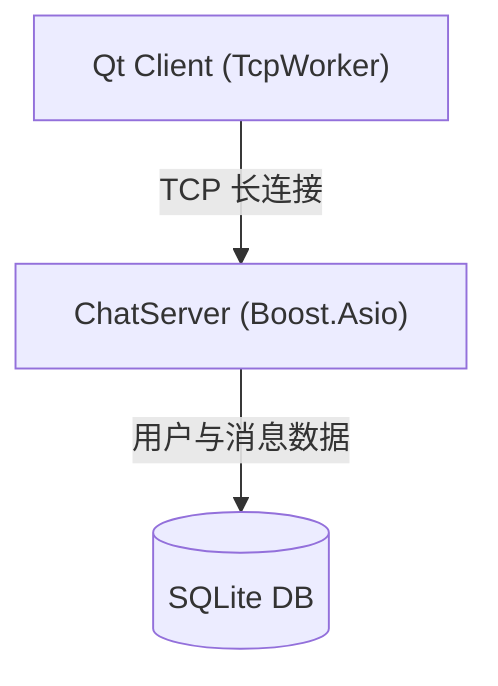

# msrChat (基于 Qt/Boost.Asio 的即时通讯系统)

<p align="center">
  
  
  
  
</p>

---

## 项目简介

**msrChat** 是一个即时通讯（IM）系统，采用 **C++17** 标准开发，客户端使用 **Qt 6**，服务端基于 **Boost.Asio** 异步网络库。

服务端内置用户认证（注册/登录/重置密码），使用 **SQLite** 本地存储用户与消息数据，支持文件传输。客户端通过单一 TCP 长连接与服务端通信。

### 核心功能

| 功能 | 说明 |
|------|------|
| **用户认证** | 注册（邮箱验证码）、登录（SHA256）、重置密码 |
| **消息收发** | 文本消息、离线消息存储、消息确认（ACK）机制 |
| **文件传输** | 分块传输、断点续传、MD5 校验 |
| **心跳检测** | 客户端定时 ping/pong，45 秒超时判定 |
| **自动重连** | 连接断开后指数退避重连（3s ~ 60s） |

### 最新优化

- **无锁消息分发**: LogicSystem 运行时无锁读取 `_handlers` 表
- **高效任务表**: FileTransfer 使用 `shared_mutex`，支持并发读
- **异步文件传输**: FileSender 用 `boost::asio::steady_timer` 替代线程延迟
- **内存安全**: RingBuffer 改用 `unique_ptr`，DbWorker 超时放弃手动清理

## 系统架构



### 核心组件

**服务端 (ChatServer)**

| 组件 | 说明 |
|------|------|
| **CServer** | TCP 服务器入口，管理连接接入和会话生命周期 |
| **CSession** | 单会话管理，处理协议解析（6字节头 + 变长body） |
| **LogicSystem** | 业务逻辑处理，消息分发到 handler 或 MessageDispatcher |
| **SQLiteMgr** | SQLite 连接池，支持优雅关闭 |
| **FileTransfer** | 文件传输核心，支持分块传输和断点续传 |

**客户端 (QmsrChat)**

| 组件 | 说明 |
|------|------|
| **TcpWorker** | TCP 通信核心，独立线程运行，含 RingBuffer 和心跳 |
| **FileSendMgr** | 文件发送管理，分块发送（64KB/chunk） |
| **FileRecvMgr** | 文件接收管理，临时文件 + rename 机制 |
| **DbThreadPool** | SQLite 数据库操作线程池 |
| **RingBuffer** | 环形缓冲区，支持自动扩容（64KB ~ 4MB） |

## 目录结构

```
msrChat/
├── client/                          # Qt 客户端
│   └── QmsrChat/
│       ├── include/
│       │   ├── TcpWorker.h          # TCP 通信核心
│       │   ├── TcpMgr.h             # TCP 连接管理器
│       │   ├── DbWorker.h           # SQLite 数据库工作线程
│       │   ├── DbMgr.h              # 数据库管理器
│       │   ├── FileSendMgr.h        # 文件发送管理
│       │   ├── FileRecvMgr.h        # 文件接收管理
│       │   ├── RingBuffer.h         # 环形缓冲区
│       │   ├── UserMgr.h            # 用户数据管理
│       │   ├── ProtocolStructs.h    # 协议结构体
│       │   ├── ChatController.h     # 聊天业务控制器
│       │   ├── ChatDialog.h         # 聊天窗口
│       │   ├── MainWindow.h         # 主窗口
│       │   ├── LoginDialog.h        # 登录对话框
│       │   ├── RegisterDialog.h     # 注册对话框
│       │   └── ResetDialog.h        # 重置密码对话框
│       └── src/
├── server/                          # 服务端
│   └── ChatServer/
│       ├── include/
│       │   ├── CServer.h            # TCP 服务器入口
│       │   ├── CSession.h           # 单会话管理
│       │   ├── LogicSystem.h         # 业务逻辑处理
│       │   ├── SQLiteMgr.h           # SQLite 连接池
│       │   ├── SessionManager.h      # 会话管理器
│       │   ├── TokenManager.h        # Token 管理器
│       │   ├── OfflineStorage.h      # 离线消息存储
│       │   ├── FileTransfer.h        # 文件传输核心
│       │   ├── ThreadPool.h          # 线程池
│       │   ├── ObjectPool.h          # 对象池
│       │   ├── AsioIOServicePool.h   # Asio I/O 服务池
│       │   └── Protocol/             # 协议实现
│       │       ├── BaseProtocol.h
│       │       ├── TLVProtocol.h
│       │       └── BinaryPacketProtocol.h
│       └── src/
├── README.md
└── .gitignore
```

## 技术栈

| 类别 | 技术 | 说明 |
|------|------|------|
| **语言** | C++17 | Lambda、智能指针、atomic、string_view |
| **网络** | Boost.Asio | 异步 I/O、strand、steady_timer |
| **数据库** | SQLite3 | 嵌入式，事务支持，连接池 |
| **客户端** | Qt 6 | 跨平台 GUI、网络、数据库 |
| **构建** | CMake | 跨平台构建 |

## 编译与运行

### 依赖项

**服务端:** GCC 9+ / CMake 3.15+ / Boost 1.70+ / SQLite3
**客户端:** Qt 6.2+ / CMake 3.15+ / C++17 编译器

### 服务端编译

```bash
cd server/ChatServer
mkdir -p build && cd build
cmake .. -DCMAKE_BUILD_TYPE=Release
make -j$(nproc)
./ChatServer
```

### 客户端编译

```bash
cd client/QmsrChat
mkdir -p build && cd build
cmake .. -DCMAKE_BUILD_TYPE=Release
make -j$(nproc)
./QmsrChat
```

## 核心模块详解

### 客户端 TcpWorker

TcpWorker 在独立线程中运行，负责 TCP 连接、协议解析、心跳和重连：

```cpp
// 初始化缓冲区（2MB，支持自动扩容至 4MB）
_recv_buffer(RingBuffer(2 * 1024 * 1024))

// 安全的数据接收
void TcpWorker::slot_ready_read()
{
    QByteArray data = _socket->readAll();
    size_t data_size = data.size();

    // 1. 安全检查：单次数据包不能超过 4MB
    if (data_size > RingBuffer::kMaxCapacity) {
        qWarning() << "SECURITY: Malicious oversized packet";
        _socket->abort();
        return;
    }

    // 2. 写入缓冲区（自动扩容）
    if (!_recv_buffer.Write(data.constData(), data_size)) {
        qWarning() << "SECURITY: Buffer write failed";
        _socket->abort();
        return;
    }

    // 3. 协议解析循环
    ParseMessages();
}
```

### 心跳机制

客户端维护三个定时器：

| 定时器 | 间隔 | 功能 |
|--------|------|------|
| `_heartbeat_timer` | 15 秒 | 发送 MSG_HELLO (ping) |
| `_pong_check_timer` | 5 秒 | 检查是否收到 pong |
| `_reconnect_timer` | 指数退避 | 断线重连（3s → 60s） |

```cpp
// 连接成功时启动
void TcpWorker::slot_connected()
{
    _heartbeat_timer->start(15000);   // 每 15 秒发一次 ping
    _pong_check_timer->start(5000);   // 每 5 秒检查一次 pong
    _last_pong_time = QDateTime::currentMSecsSinceEpoch();
}

// 收到 pong 时重置时间戳
if (_message_id == RequestType::MSG_HELLO) {
    _last_pong_time = QDateTime::currentMSecsSinceEpoch();
}

// 超时判定：45 秒未收到 pong 则断开重连
if (elapsed > 45000) {
    _socket->disconnectFromHost();  // 触发重连流程
}
```

### RingBuffer 防溢出

RingBuffer 保证数据安全：

```cpp
// 自动扩容（最大 4MB）
bool RingBuffer::Write(const char *data, size_t len) {
    while (len > GetSpaceAvailable(_write_pos)) {
        if (!Expand()) return false;  // 扩容失败则拒绝
    }
    // ... 写入数据
}

// 扩容逻辑
bool RingBuffer::Expand() {
    if (_capacity >= kMaxCapacity) return false;
    new_capacity = std::min(_capacity * 2, kMaxCapacity);
    // ... 复制数据到新缓冲区
}
```

### 服务端消息分发（无锁设计）

LogicSystem 在运行时无锁读取 handler 表：

```cpp
// LogicSystem.cpp - 无锁消息处理
void LogicSystem::ProcessTask(MessageTask task)
{
    auto session = task.LockSession();
    if (!session || session->IsClosed()) return;

    // 直接访问 _handlers，无锁读取
    auto it = _handlers.find(task.msg_id);
    if (it != _handlers.end()) {
        handler = it->second;
    }

    if (handler) {
        handler(session, task.body_data);
    } else {
        // 委托给 MessageDispatcher
        MessageDispatcher::Instance().Dispatch(...);
    }
}

// 仅在启动时注册（main.cpp 中，io_context.run() 之前）
void LogicSystem::RegisterHandler(uint16_t msg_id, BusinessHandler handler) {
    _handlers[msg_id] = std::move(handler);
}
```

### 文件传输流程

```
发送端                          接收端                          协议
  |                               |                             |
  |--- MSG_FILE_REQ ------------->|  (task_id, filename, size) |
  |<-- MSG_FILE_RSP --------------|  (task_id, offset=0 Ready) |
  |                               |                             |
  |-- MSG_FILE_CHUNK (0, 64KB) -->|                             |
  |<-- MSG_FILE_ACK -------------|  (task_id, received=64KB)   |
  |                               |                             |
  |-- MSG_FILE_CHUNK (64KB, ...) ->|                             |
  ... 循环直到发完 ...            |                             |
  |                               |                             |
  |<-- MSG_FILE_ACK (complete) ---|                             |
```

**FileSender 异步延迟**（避免线程创建开销）：

```cpp
// FileTransfer.cpp - 用 steady_timer 替代 thread.detach()
void FileSender::SendChunkData(const char *data, size_t len)
{
    // ... 发送数据 ...

    // 用 Asio 定时器做 10ms 延迟，避免创建线程
    _timer.expires_after(std::chrono::milliseconds(10));
    _timer.async_wait([weak_self, this](const boost::system::error_code &ec) {
        if (ec || _stopped.load()) return;
        auto self = weak_self.lock();
        if (self) SendNextChunk();
    });
}
```

### SQLite 连接池优雅关闭

```cpp
// SQLiteMgr.cpp - 优雅关闭
void SQLiteConnectionPool::Shutdown()
{
    std::lock_guard<std::mutex> lock(_mutex);
    if (_shutdown.load()) return;

    _shutdown.store(true);
    _cv.notify_all();        // 唤醒所有等待的线程
    CloseAllConnections();
}

// Acquire 的优雅退出
std::shared_ptr<SQLiteConnection> SQLiteConnectionPool::Acquire()
{
    std::unique_lock<std::mutex> lock(_mutex);
    _cv.wait(lock, [this] { return !_available.empty() || _shutdown.load(); });

    if (_shutdown.load()) return nullptr;  // shutdown 后返回空指针
    // ...
}
```

## 协议格式

### 消息头格式

```
+--------+--------+--------+
|MsgID(2B)|Length(4B)| Data |
+--------+--------+--------+
```

### 消息类型

| MsgID | 功能 |
|-------|------|
| 0x01 | 注册 |
| 0x02 | 登录 |
| 0x03 | 重置密码 |
| 0x04 | 验证码 |
| 0x05 | 聊天认证 |
| 0x06 | 文本消息 |
| 0x07 | 消息确认 |
| 0x08 | 离线消息查询 |
| 0x10 | 文件传输（分块） |

### 文件传输协议

```
MSG_FILE_REQ    → 文件请求（task_id, filename, size, md5）
MSG_FILE_RSP    → 接收端响应（offset，Ready 或 续传位置）
MSG_FILE_CHUNK  → 数据块（task_id, offset, binary_data）
MSG_FILE_ACK    → 确认（received_size 或 complete）
```

## 测试

### 消息发送测试

```bash
# 使用 nc 测试基础连接
nc localhost 8888

# 发送注册请求（16进制）
echo -n -e '\x00\x01\x00\x00\x00\x2c{"username":"test","email":"a@b.com","password":"123456"}' | nc localhost 8888

# 发送登录请求
echo -n -e '\x00\x02\x00\x00\x00\x1f{"username":"test","password":"hash"}' | nc localhost 8888
```

### 文件传输测试

```bash
# 准备测试文件
dd if=/dev/urandom of=test.bin bs=1M count=10

# 通过客户端界面上传
# 观察日志输出：
# - MSG_FILE_REQ 发送
# - MSG_FILE_RSP 接收（Ready 或 offset）
# - MSG_FILE_CHUNK 分块发送
# - MSG_FILE_ACK 确认
```

### 心跳测试

观察客户端日志：
```cpp
// 客户端每 15 秒输出
qDebug() << "Sending ping" << QTime::currentTime();

// 收到 pong 时
qDebug() << "Pong received, last_pong_time updated";
```

## 调试

### 服务端日志（spdlog）

```cpp
// 设置调试级别
spdlog::set_level(spdlog::level::debug);

// 设置日志格式
spdlog::set_pattern("[%Y-%m-%d %H:%M:%S.%e] [%^%L%$] [%t] %v");

// 关键日志点
spdlog::info("[LogicSystem] Processing msg_id {} for session {}", msg_id, uuid);
spdlog::debug("[CSession] AsyncReadBody completed, {} bytes", body_size);
```

### 客户端日志（qDebug）

```cpp
// 设置格式
qSetMessagePattern("[%{time HH:mm:ss.zzz}] [%{type}] %{message}");

// 关键日志点
qDebug() << "Heartbeat: sending ping at" << QTime::currentTime();
qWarning() << "SECURITY: Buffer write failed, disconnecting";
```

### 常见问题

**Q: 编译失败，提示找不到 Boost**
```bash
# Ubuntu/Debian
sudo apt install libboost-all-dev

# CentOS/RHEL
sudo yum install boost-devel

# macOS (Homebrew)
brew install boost
```

**Q: 文件传输失败**
1. 检查服务端和客户端版本一致性
2. 确认网络连接正常
3. 查看服务端日志中的文件传输详细输出

**Q: 数据库锁定**
```bash
# 检查是否有进程占用数据库
lsof chat.db

# 删除锁文件（如有）
rm -f chat.db-lock
```

**Q: 客户端显示"连接成功"但无法收发消息**
检查是否收到服务端的聊天认证响应（MSG_CHAT_LOGIN_RSP），未认证的连接只能发送登录/注册指令。

## 贡献

欢迎提交 Issue 和 Pull Request！

## 许可证

MIT License